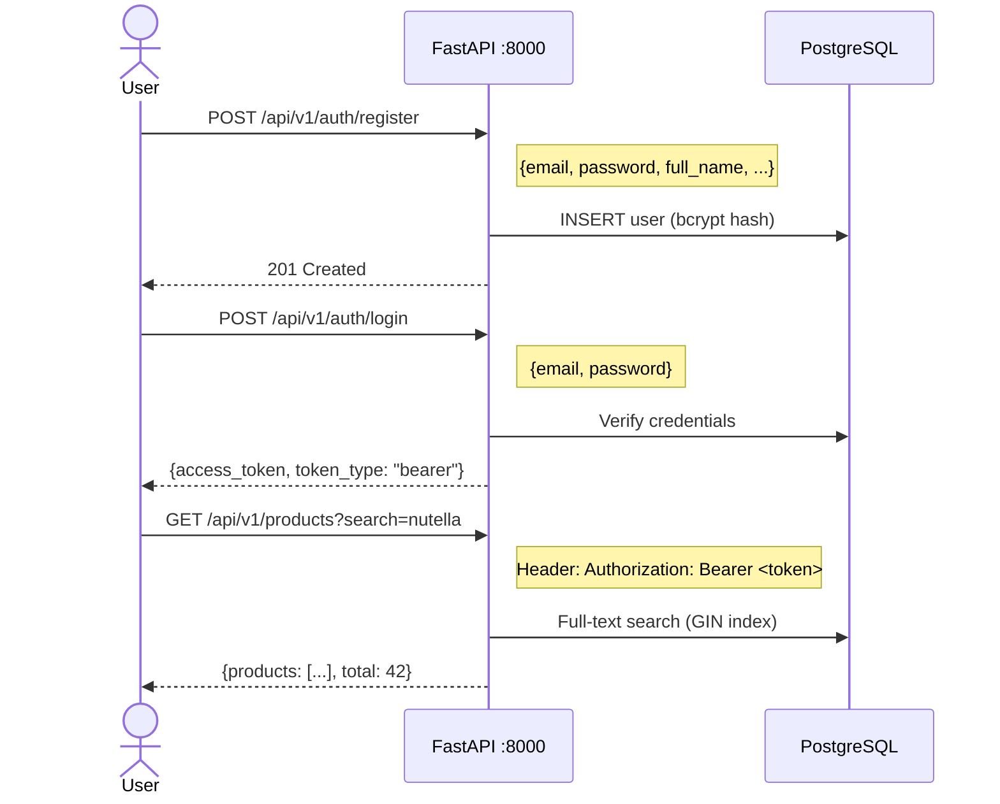
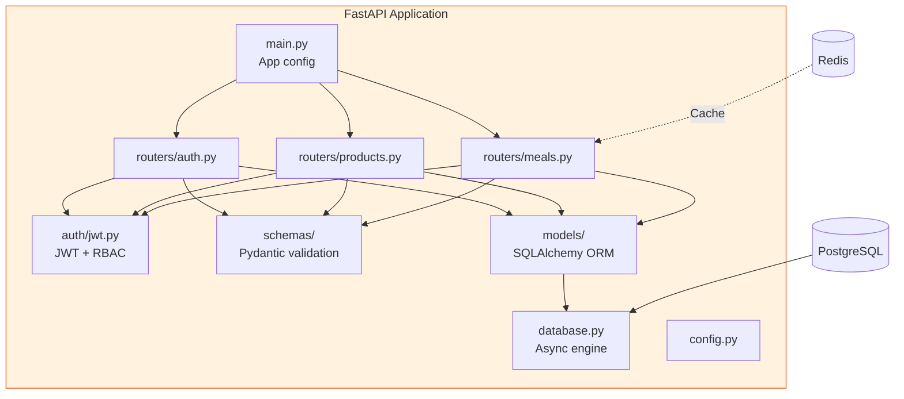

# REST API Reference

## Overview (C12)

FastAPI REST API with JWT authentication, role-based access control, and auto-generated OpenAPI 3.0 documentation.

**Base URL**: `http://localhost:8000`
**Docs**: `http://localhost:8000/docs` (Swagger) | `http://localhost:8000/redoc` (ReDoc)

## Authentication Flow



## Endpoints

### Authentication (`/api/v1/auth/`)

| Method | Path | Auth | Description |
|--------|------|------|-------------|
| `POST` | `/register` | None | Create new user account |
| `POST` | `/login` | None | Get JWT access token (60min) |
| `GET` | `/me` | Bearer | Get current user profile |

### Products (`/api/v1/products/`)

| Method | Path | Auth | Description |
|--------|------|------|-------------|
| `GET` | `/` | Bearer | Search products (full-text, paginated) |
| `GET` | `/{barcode}` | Bearer | Get product by barcode |
| `GET` | `/{product_id}/alternatives` | Bearer | Find healthier alternatives |

**Query parameters for search**:

| Param | Type | Default | Description |
|-------|------|---------|-------------|
| `search` | string | required | Search term |
| `page` | int | 1 | Page number |
| `page_size` | int | 20 | Results per page (max 100) |

### Meals (`/api/v1/meals/`)

| Method | Path | Auth | Description |
|--------|------|------|-------------|
| `POST` | `/` | Bearer | Log a meal with items |
| `GET` | `/` | Bearer | List user's meals (paginated) |
| `GET` | `/daily-summary` | Bearer | Today's nutritional totals (cached) |
| `GET` | `/weekly-trends` | Bearer | 7-day nutrition summary |
| `GET` | `/{meal_id}` | Bearer | Get specific meal details |

## Request/Response Examples

### Register User

```bash
curl -X POST http://localhost:8000/api/v1/auth/register \
  -H "Content-Type: application/json" \
  -d '{
    "email": "user@example.com",
    "password": "securepass123",
    "full_name": "Jane Doe",
    "date_of_birth": "1990-05-15",
    "activity_level": "moderate",
    "consent_data_processing": true
  }'
```

### Search Products

```bash
curl http://localhost:8000/api/v1/products/?search=chocolate \
  -H "Authorization: Bearer <token>"
```

```json
{
  "products": [
    {
      "id": 1,
      "barcode": "3017620422003",
      "product_name": "Nutella",
      "nutriscore_grade": "E",
      "nova_group": 4,
      "energy_kcal_100g": 539.0,
      "brand": {"name": "Ferrero"},
      "category": {"name": "Spreads"}
    }
  ],
  "total": 156,
  "page": 1,
  "page_size": 20
}
```

## Architecture



## Security Features

| Feature | Implementation |
|---------|---------------|
| Password hashing | bcrypt (passlib) |
| Token auth | JWT with 60-min expiry |
| Role-based access | `@require_role()` decorator |
| Input validation | Pydantic schemas |
| SQL injection prevention | SQLAlchemy parameterized queries |
| CORS | Configurable origins |
| Rate limiting | Planned (not yet implemented) |
