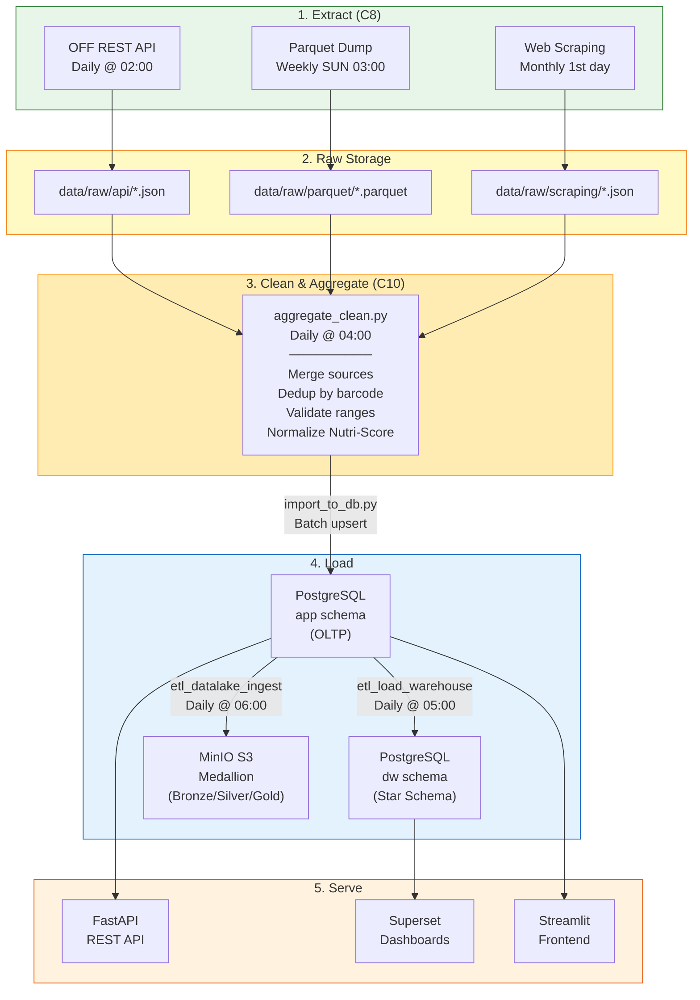
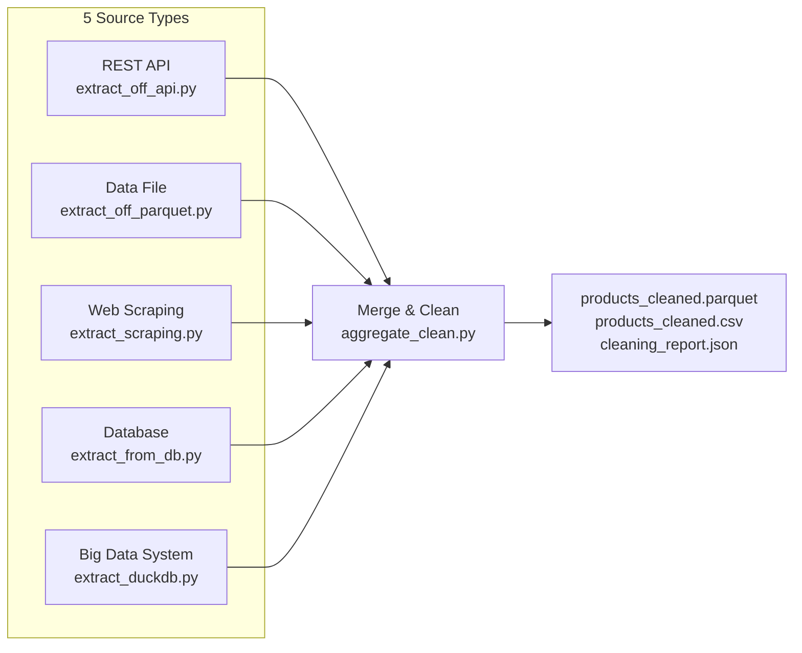

# Data Flow Pipeline

## End-to-End Data Flow

## Flux Matrix

| Source | Format | Target | Treatment Script | Frequency | Volume |
|--------|--------|--------|-----------------|-----------|--------|
| OFF REST API | JSON | `data/raw/api/` | `extract_off_api.py` | Daily | ~1,000 products |
| OFF Parquet dump | Parquet | `data/raw/parquet/` | `extract_off_parquet.py` | Weekly | 50,000 products |
| ANSES/EFSA websites | HTML→JSON | `data/raw/scraping/` | `extract_scraping.py` | Monthly | Guidelines |
| PostgreSQL (app) | SQL | DW star schema | `etl_load_warehouse.py` | Daily | Incremental |
| PostgreSQL (app) | SQL/Parquet | MinIO bronze | `etl_datalake_ingest.py` | Daily | Full snapshot |
| Raw sources merged | CSV/Parquet | `data/cleaned/` | `aggregate_clean.py` | Daily | ~50,000 rows |

## Extraction Sources (5 types — C8)

## Data Cleaning Pipeline

The `aggregate_clean.py` script performs:

1. **Column standardization** — 30+ column name mappings across sources
2. **Barcode cleaning** — strip non-numeric, validate length 8–14
3. **Null removal** — drop products without names
4. **Range validation** — cap nutrient values at physiological max per 100g
5. **Nutri-Score normalization** — uppercase A–E
6. **Deduplication** — by barcode, keeping most complete record
7. **Quality report** — outputs `cleaning_report.json` with statistics
