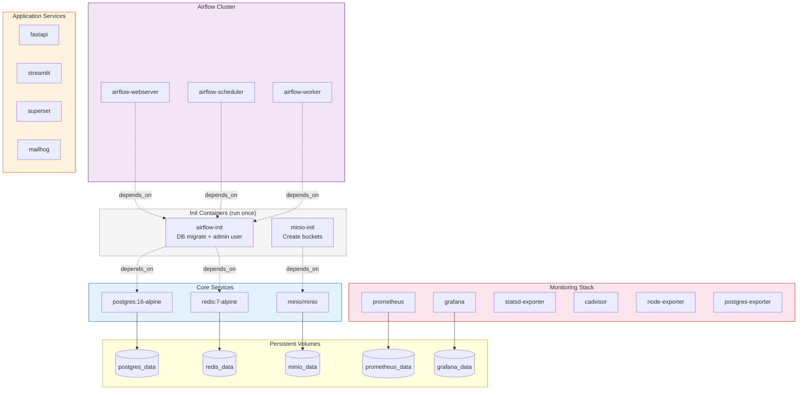
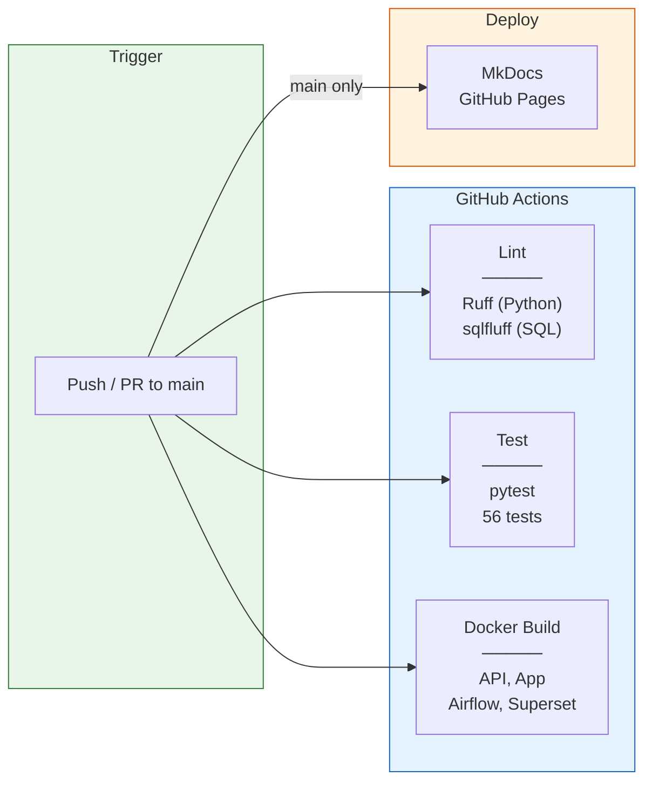

# Infrastructure

## Docker Compose Architecture

All services are defined in a single `docker-compose.yml` with health checks, restart policies, and persistent volumes.

## Resource Requirements

| Service | CPU | Memory | Disk |
|---------|-----|--------|------|
| PostgreSQL | 1 core | 512MB | 2GB+ |
| MinIO | 0.5 core | 256MB | 5GB+ |
| Airflow (3 services) | 2 cores | 2GB | 500MB |
| Superset | 1 core | 1GB | 200MB |
| Monitoring (5 services) | 1 core | 512MB | 1GB |
| **Total** | **~6 cores** | **~5GB** | **~10GB** |

## CI/CD Pipelines

### Workflow Details

| Workflow | File | Trigger | What it does |
|----------|------|---------|-------------|
| **Lint** | `lint.yml` | Push/PR to main | Ruff on `*.py`, sqlfluff on `*.sql` |
| **Test** | `test.yml` | Push/PR to main | pytest with Python 3.11 (56 tests) |
| **Docker** | `docker.yml` | Push/PR to main | Build-validates all 4 Dockerfiles |
| **Docs** | `deploy-docs.yml` | Push to main | Build & deploy MkDocs to GitHub Pages |
