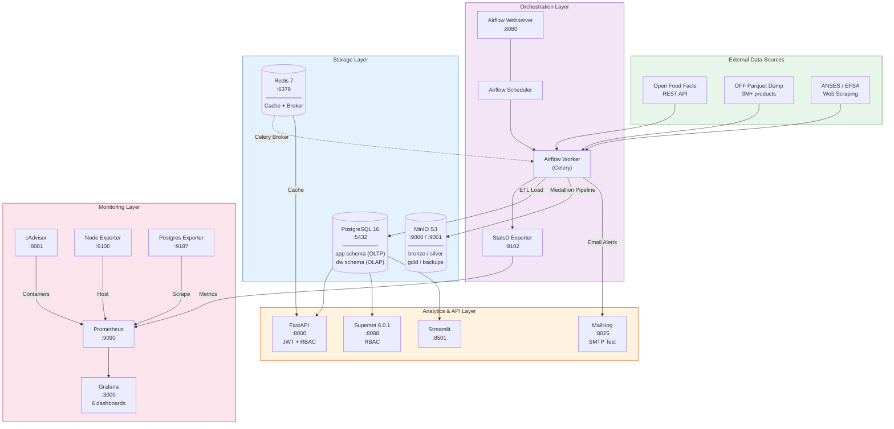
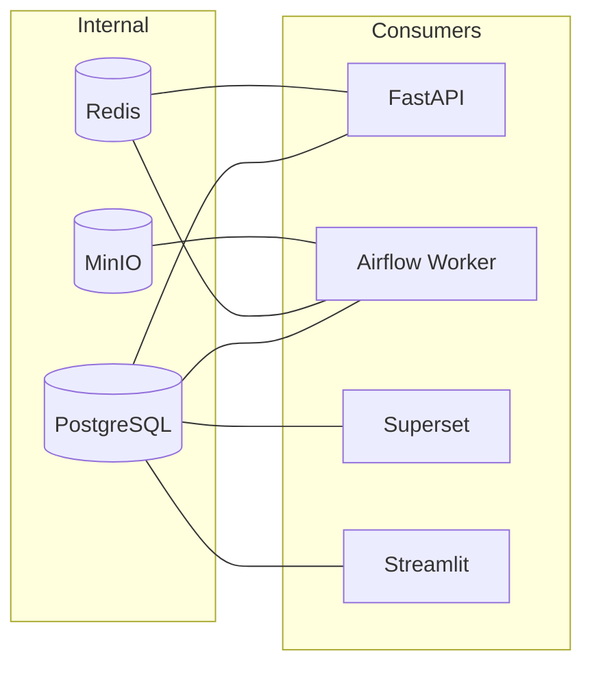

# System Architecture

## Overview

NutriTrack is a containerized data engineering platform with **15 Docker services** spanning 5 layers: data sources, orchestration, storage, analytics, and monitoring.

## Full Architecture Diagram



## Service Matrix

| Service | Image | Port(s) | Layer | Purpose |
|---------|-------|---------|-------|---------|
| `postgres` | postgres:16-alpine | 5432 | Storage | Operational DB + Data Warehouse |
| `redis` | redis:7-alpine | 6379 | Storage | API cache + Airflow Celery broker |
| `minio` | minio/minio:latest | 9000, 9001 | Storage | S3-compatible data lake |
| `airflow-webserver` | custom | 8080 | Orchestration | Airflow UI |
| `airflow-scheduler` | custom | — | Orchestration | DAG scheduling |
| `airflow-worker` | custom | — | Orchestration | Celery task execution |
| `fastapi` | custom | 8000 | Analytics | REST API (JWT + RBAC) |
| `streamlit` | custom | 8501 | Analytics | Web frontend |
| `superset` | custom | 8088 | Analytics | BI dashboards |
| `mailhog` | mailhog/mailhog | 1025, 8025 | Analytics | SMTP test server |
| `prometheus` | prom/prometheus | 9090 | Monitoring | Metrics collection |
| `grafana` | grafana/grafana | 3000 | Monitoring | Dashboards |
| `statsd-exporter` | prom/statsd-exporter | 9102, 9125 | Monitoring | Airflow metrics bridge |
| `cadvisor` | gcr.io/cadvisor | 8081 | Monitoring | Container metrics |
| `node-exporter` | prom/node-exporter | 9100 | Monitoring | Host metrics |
| `postgres-exporter` | prometheuscommunity/postgres-exporter | 9187 | Monitoring | DB metrics |

## Network Topology

All services communicate over a shared Docker bridge network. Key connections:



## Deployment

Single-command deployment via Docker Compose:

```bash
docker compose up -d --build
```

All services include health checks, restart policies (`unless-stopped`), and persistent volumes for data durability.

### Persistent Volumes

| Volume | Service | Purpose |
|--------|---------|---------|
| `postgres_data` | PostgreSQL | Database files |
| `redis_data` | Redis | Cache persistence |
| `minio_data` | MinIO | Object store |
| `prometheus_data` | Prometheus | Metric time series |
| `grafana_data` | Grafana | Dashboard state |
