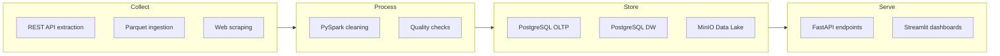

# Technical Architecture

**Competencies**: C3 (Technical Framework), C4 (Technical Monitoring)
**Evaluation**: E2 (professional report)

---

## Functional Analysis

### What does the system do?

NutriTrack provides four core functions:

1. **Collect** nutritional data from 3 external sources (REST API, Parquet files, web scraping)
2. **Clean and aggregate** data using a 7-rule PySpark pipeline
3. **Store** data in a relational warehouse (star schema) and object lake (medallion architecture)
4. **Serve** data through a REST API and multi-role web interface

### Business Constraints

| Constraint | Response |
|-----------|----------|
| Budget: zero CAPEX | Open-source stack only |
| French products only | OFF API filtered by `countries_tags=fr` |
| Health data sensitivity | RGPD compliance, consent, anonymization in DW |
| Multi-user access | 4 roles with distinct permissions |
| Reproducibility | Docker Compose, version-pinned dependencies |

## Technology Decisions

| Decision | Choice | Alternative 1 | Alternative 2 | Rationale |
|----------|--------|---------------|---------------|-----------|
| Database | PostgreSQL 16 | MySQL 8 | MongoDB | Multi-schema, star schema support, pg_dump for backups |
| Object Store | MinIO | AWS S3 | HDFS | Self-hosted, S3-compatible API, zero cost |
| Orchestration | Airflow 2.8 | Prefect | Apache NiFi | DAG-based, Celery executor, StatsD metrics |
| Data Cleaning | PySpark 3.5 | Pandas | Polars | Handles 800K rows, distributed-ready, certification relevance |
| API Framework | FastAPI | Flask | Django REST | Async, auto OpenAPI docs, Pydantic validation |
| Frontend | Streamlit | Dash | React | Python-native, rapid multi-page apps, role-based routing |
| Monitoring | Prometheus + Grafana | ELK Stack | Datadog | Open-source, pull-based, dashboard provisioning as code |

## CAPEX / OPEX Comparison

### CAPEX: 0 EUR

All technologies are open-source. No license fees, no cloud service subscriptions.

### OPEX: < 100 EUR/year

| Item | Cost | Notes |
|------|------|-------|
| Domain name (optional) | ~15 EUR/year | For public-facing documentation |
| GitHub Pages hosting | 0 EUR | Free for public repositories |
| Development machine | 0 EUR | Uses existing hardware |
| Cloud hosting (optional) | 0--80 EUR/year | Only if deployed beyond local Docker |
| **Total** | **< 100 EUR/year** | |

!!! info "Cloud Comparison"
    An equivalent AWS deployment (RDS + S3 + ECS + CloudWatch) would cost approximately 150--300 EUR/month. The self-hosted Docker approach saves 1,700--3,500 EUR/year.

## Architecture Representations

### Functional Representation

### Infrastructure Representation

See the full [Architecture diagram](../overview/architecture.md) for all 15 services with ports and connections.

### Operational Representation

See the [ETL Pipelines](../block3/etl-pipelines.md) page for the 7 Airflow DAGs and scheduling.

## RGPD Compliance (C3)

| Measure | Implementation |
|---------|---------------|
| **Consent** | `consent_data_processing` boolean on user registration |
| **Data minimization** | Only essential fields collected (email, name, activity level) |
| **Purpose limitation** | Data used exclusively for nutrition tracking |
| **Encryption** | Passwords hashed with bcrypt; data at rest in Docker volumes |
| **Anonymization** | SHA256 user hash in data warehouse (`dim_user`) |
| **Right to deletion** | Automated `rgpd_cleanup_expired_data()` stored procedure |
| **Personal data registry** | `app.rgpd_data_registry` table with categories, legal basis, retention |
| **Retention policy** | 2 years for personal data, automated cleanup via Airflow |

## Eco-Responsibility (RGESN)

| Principle | Application |
|-----------|-------------|
| **Minimize resources** | Alpine-based Docker images where possible |
| **Efficient storage** | Parquet columnar format (10x compression vs CSV) |
| **Scheduled processing** | Off-peak ETL execution (02:00--06:00 UTC) |
| **Data lifecycle** | Bronze bucket auto-deletes after 90 days; backups after 30 days |
| **Shared infrastructure** | Single PostgreSQL instance with schema separation vs. multiple DB servers |

## Risk Analysis

| Risk | Probability | Impact | Mitigation |
|------|------------|--------|------------|
| OFF API unavailable | Medium | Low | Parquet dump as fallback; retry logic in DAGs |
| Disk space exhaustion | Low | High | MinIO lifecycle rules; Grafana alerts at 80% |
| Data quality degradation | Medium | Medium | 6 automated quality checks; PySpark validation |
| Security breach | Low | High | JWT expiry, bcrypt hashing, role-based access |
| Single point of failure | Medium | High | Docker restart policies; daily backups to MinIO |
