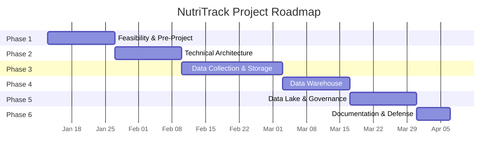

# Project Planning

**Competencies**: C5 (Planning), C6 (Supervision), C7 (Communication)
**Evaluation**: E3 (kickoff meeting simulation)

---

## Project Roadmap

The project follows 6 phases over approximately 12 weeks:

| Phase | Duration | Deliverables | Competencies |
|-------|----------|-------------|-------------|
| **1. Feasibility & Pre-Project** | 2 weeks | Need analysis, interview grids, synthesis note, data topography | C1, C2 |
| **2. Technical Architecture** | 2 weeks | Architecture study, tech decisions, flux matrix, RGPD analysis | C3, C4 |
| **3. Data Collection & Storage** | 3 weeks | Extraction scripts (3 sources), cleaning pipeline, PostgreSQL schemas, REST API | C8, C9, C10, C11, C12 |
| **4. Data Warehouse** | 2 weeks | Star schema, ETL DAGs, SCD implementation, datamarts | C13, C14, C15 |
| **5. Data Lake & Governance** | 2 weeks | Medallion architecture, catalog, RBAC, monitoring, alerting | C16, C17, C18, C19, C20, C21 |
| **6. Documentation & Defense** | 1 week | Reports (E1--E7), presentation slides, live demo preparation | C5, C6, C7 |

## Team Composition

| Role | Responsibility | Skills Required |
|------|---------------|-----------------|
| **Data Engineer** (project lead) | Full pipeline development, architecture decisions | Python, SQL, Docker, Airflow, PySpark |
| **Certification Assessor** | Competency validation, gap analysis | RNCP37638 referential knowledge |
| **Client (Sophie Yang)** | Business requirements, UAT feedback | Nutrition domain expertise |

!!! info "Solo Project"
    As a certification capstone, this is an individual project. The team roles above represent the stakeholder interactions simulated during the defense.

## Budget Allocation

| Category | Budget | Actual |
|----------|--------|--------|
| Infrastructure (CAPEX) | 0 EUR | 0 EUR |
| Software licenses | 0 EUR | 0 EUR |
| Hosting (OPEX annual) | < 100 EUR | < 100 EUR |
| Training / documentation | 0 EUR | 0 EUR |
| **Total** | **< 100 EUR** | **< 100 EUR** |

## Effort Weighting

Tasks are estimated using **Fibonacci-based story points** (1, 2, 3, 5, 8, 13):

| Task Category | Story Points | Actual Effort |
|---------------|-------------|---------------|
| Extraction scripts (3 sources) | 8 | 3 days |
| PySpark cleaning pipeline | 8 | 2 days |
| PostgreSQL schema + import | 5 | 2 days |
| FastAPI + JWT + RBAC | 8 | 3 days |
| Streamlit frontend (4 roles) | 13 | 5 days |
| Star schema + ETL DAGs | 8 | 3 days |
| MinIO medallion pipeline | 5 | 2 days |
| Monitoring + alerting | 5 | 2 days |
| Documentation (all E1--E7) | 13 | 5 days |

## Project Tracking

### Tools

| Tool | Purpose |
|------|---------|
| **GitHub Issues** | Task tracking, bug reports, feature requests |
| **GitHub Projects** | Kanban board (To Do / In Progress / Review / Done) |
| **Git branches** | Feature branches with PR-based review |
| **GitHub Actions** | Automated lint, test, and Docker build on each PR |
| **Airflow UI** | DAG execution monitoring and log inspection |
| **Grafana** | SLA compliance and system health dashboards |

### Rituals

| Ritual | Frequency | Duration | Purpose |
|--------|-----------|----------|---------|
| Daily standup (self-review) | Daily | 15 min | Review blockers, plan the day |
| Sprint review | Bi-weekly | 30 min | Demo completed features |
| Retrospective | Bi-weekly | 20 min | Process improvement |
| Stakeholder demo | Per phase | 30 min | Validate deliverables with client |

### Indicators

| Indicator | Target | Tracking Method |
|-----------|--------|----------------|
| Tasks completed per sprint | 80%+ | GitHub Projects board |
| CI pipeline pass rate | > 95% | GitHub Actions dashboard |
| ETL success rate | > 95% | Grafana SLA dashboard |
| Data freshness | < 24 hours | Prometheus metrics |
| Test coverage | > 70% | pytest + coverage report |

## Communication Strategy (C7)

### Stakeholder Map

| Stakeholder | Interest | Communication Needs |
|------------|----------|-------------------|
| **Client (Sophie Yang)** | Product functionality, usability | Phase demos, user guides |
| **Certification Jury** | Competency evidence, technical rigor | Defense slides, professional reports |
| **End Users (patients)** | Meal logging, daily tracking | Streamlit UI, in-app help |
| **Data Analysts** | Query access, data quality | API docs, schema documentation |

### Communication Plan

| Event | Audience | Format | Timing |
|-------|----------|--------|--------|
| **Project kickoff** | All stakeholders | Presentation + pre-project document | Phase 1 start |
| **Phase completion** | Client + jury | Demo + written summary | End of each phase |
| **Architecture review** | Technical stakeholders | Architecture diagram + decision log | Phase 2 |
| **Beta demo** | Client + end users | Live Streamlit walkthrough | Phase 4 |
| **Final delivery** | Jury | Defense slides + full reports | Phase 6 |
| **User onboarding** | End users | Written guide + Streamlit walkthrough | Post-delivery |

### Documentation Artifacts

| Document | Audience | Format |
|----------|----------|--------|
| Interview grids (E1) | Jury | PDF |
| Professional report (E2) | Jury | 10--15 page PDF |
| Kickoff presentation (E3) | All stakeholders | Slides |
| Technical report (E4) | Jury | 5--10 page PDF |
| DW report (E5) | Jury | 5--10 page PDF |
| Maintenance report (E6) | Jury | 5--10 page PDF |
| Data Lake report (E7) | Jury | Individual PDF |
| MkDocs site | Public / jury | GitHub Pages |
| OpenAPI docs | Developers | Auto-generated at `/docs` |
