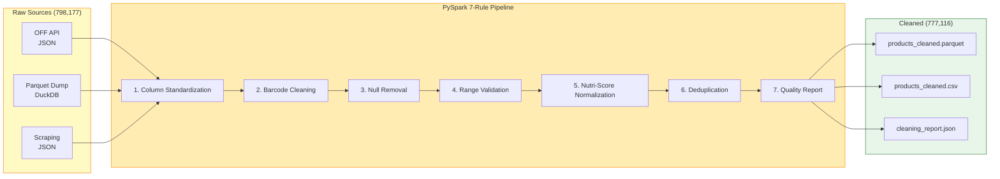
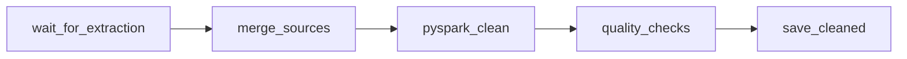

# Cleaning Pipeline

**Competencies**: C10 (Data Aggregation and Cleaning)
**Evaluation**: E4 (professional report)

---

## Overview

The `etl_aggregate_clean` DAG merges all 3 raw sources and applies a **7-rule PySpark cleaning pipeline** that reduces 798,177 raw products to 777,116 cleaned products (2.6% removal rate).



## The 7 Cleaning Rules

### Rule 1: Column Standardization

Maps 30+ column names across sources to a unified schema.

| Source Column | Standardized Column |
|--------------|-------------------|
| `product_name_fr` / `product_name` | `product_name` |
| `brands_tags` / `brands` | `brand` |
| `energy-kcal_100g` / `energy_kcal_100g` | `energy_kcal_100g` |
| `categories_tags` / `categories` | `category` |

### Rule 2: Barcode Cleaning

- Strip non-numeric characters
- Validate length: 8--14 digits (EAN-8, EAN-13, UPC)
- Remove products with invalid barcodes

### Rule 3: Null Removal

- Drop products with `NULL` product name
- Drop products with `NULL` barcode
- Keep products with partial nutritional data (common in OFF)

### Rule 4: Range Validation

Cap nutrient values at physiological maximums per 100g:

| Nutrient | Maximum (per 100g) | Rationale |
|----------|-------------------|-----------|
| Energy | 900 kcal | Pure fat = ~900 kcal |
| Fat | 100 g | Cannot exceed 100% |
| Sugars | 100 g | Cannot exceed 100% |
| Salt | 100 g | Cannot exceed 100% |
| Proteins | 100 g | Cannot exceed 100% |
| Fiber | 100 g | Cannot exceed 100% |

### Rule 5: Nutri-Score Normalization

- Convert to uppercase: `a` to `A`
- Validate against allowed values: A, B, C, D, E
- Set invalid grades to `NULL`

### Rule 6: Deduplication

- Group by barcode
- Keep the record with the most complete data (fewest NULLs)
- Log duplicate counts in the quality report

### Rule 7: Quality Report

Generates `cleaning_report.json` with:

```json
{
  "run_date": "2026-04-06T04:30:00Z",
  "input_count": 798177,
  "output_count": 777116,
  "removal_rate": 0.026,
  "removals_by_rule": {
    "invalid_barcode": 8234,
    "null_name": 5412,
    "range_violation": 2187,
    "invalid_nutriscore": 1093,
    "duplicate": 4135
  }
}
```

## Why PySpark?

| Consideration | PySpark | Pandas |
|--------------|---------|--------|
| **798K rows** | Handles easily with partitioning | Works but uses significant memory |
| **Scalability** | Can scale to millions via Spark cluster | Single-machine only |
| **DataFrame API** | Similar to Pandas, familiar syntax | Native |
| **Certification** | Demonstrates big data processing skills | Standard library |
| **Integration** | Runs inside Airflow worker container | Also runs in Airflow |

!!! tip "PySpark in Docker"
    PySpark 3.5 is installed in the Airflow worker container. The cleaning pipeline runs as a local Spark session -- no separate Spark cluster needed for this data volume.

## Data Quality Checks

6 automated checks run after cleaning and log results to `staging.data_quality_checks`:

| # | Check | Threshold | Action on Failure |
|---|-------|-----------|------------------|
| 1 | Row count > 0 | > 0 rows | CRITICAL alert |
| 2 | Null rate for key columns | < 5% | WARNING alert |
| 3 | Duplicate barcode rate | 0% | WARNING alert |
| 4 | Nutri-Score distribution | A--E only | Log anomaly |
| 5 | Nutrient range compliance | 100% in range | Log violations |
| 6 | Schema column count | Expected count | CRITICAL alert |

```sql
-- staging.data_quality_checks
CREATE TABLE staging.data_quality_checks (
    check_id      SERIAL PRIMARY KEY,
    check_name    VARCHAR(100),
    check_date    TIMESTAMP DEFAULT NOW(),
    status        VARCHAR(20),  -- PASS, FAIL, WARNING
    metric_value  NUMERIC,
    threshold     NUMERIC,
    details       JSONB
);
```

## Airflow DAG Structure



| Task | Description | Duration |
|------|-------------|----------|
| `wait_for_extraction` | ExternalTaskSensor waits for extraction DAGs | Variable |
| `merge_sources` | Combine all raw files into single DataFrame | ~2 min |
| `pyspark_clean` | Apply 7 cleaning rules | ~8 min |
| `quality_checks` | Run 6 checks, log to `staging.data_quality_checks` | ~1 min |
| `save_cleaned` | Write Parquet + CSV + quality report | ~2 min |
