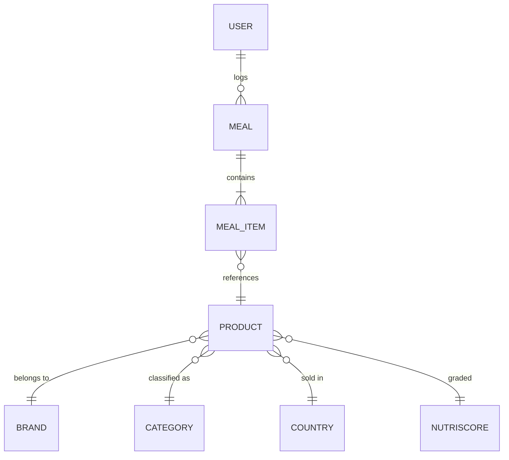
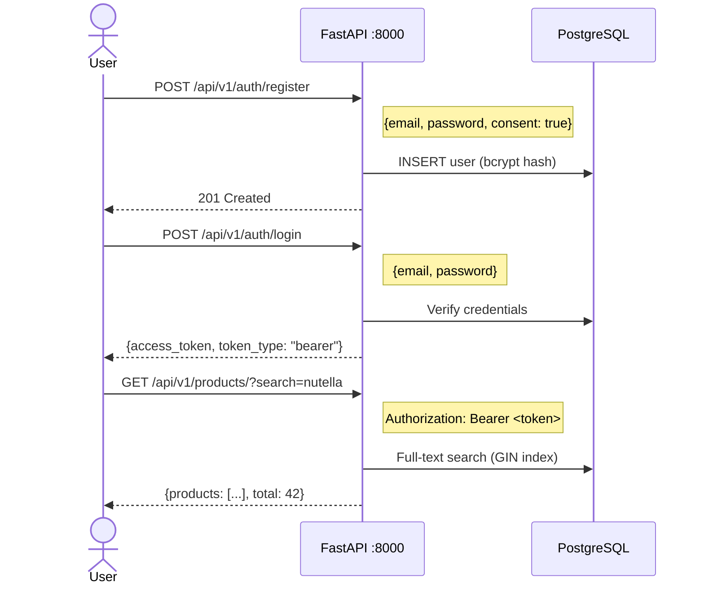

# Database and API

**Competencies**: C11 (RGPD-Compliant Database), C12 (REST API)
**Evaluation**: E4 (professional report)

---

## Database Design (C11)

### Conceptual Model (MCD)

### Logical Model (MLD)

**app schema** (OLTP):

- `users` (user_id PK, email UNIQUE, password_hash, full_name, role, activity_level, consent_data_processing, data_retention_until)
- `products` (product_id PK, barcode UNIQUE, product_name, brand, category, nutriscore_grade, nova_group, energy_kcal_100g, ...)
- `meals` (meal_id PK, user_id FK, meal_date, meal_type)
- `meal_items` (item_id PK, meal_id FK, product_id FK, quantity_g)
- `etl_activity_log` (log_id PK, dag_id, task_id, event_type, alert_category, message, details JSONB)
- `rgpd_data_registry` (registry_id PK, data_category, legal_basis, retention_period, security_measures)

### Physical Model (MPD)

PostgreSQL 16 with 4 schemas:

| Schema | Purpose | Key Tables |
|--------|---------|------------|
| `app` | Operational data | users, products, meals, meal_items, etl_activity_log |
| `raw` | Extracted raw data | raw_products_api, raw_products_parquet, raw_guidelines |
| `staging` | Intermediate processing | staging_products, data_quality_checks |
| `dw` | Star schema warehouse | 7 dimensions, 2 facts, 6 datamart views |

!!! info "RGPD Compliance"
    The `rgpd_data_registry` table documents all personal data categories, their legal basis, retention periods, and security measures -- satisfying the certification requirement for a personal data treatment registry.

---

## REST API (C12)

### Configuration

| Property | Value |
|----------|-------|
| Framework | FastAPI |
| Base URL | `http://localhost:8000` |
| OpenAPI docs | `/docs` (Swagger) and `/redoc` |
| Authentication | JWT HS256 with 60-minute expiry |
| Password hashing | bcrypt |
| Response caching | Redis (daily summary endpoint) |

### Endpoints

8 endpoints across 3 routers:

#### Authentication (`/api/v1/auth/`)

| Method | Path | Auth | Description |
|--------|------|------|-------------|
| `POST` | `/register` | None | Create user account with RGPD consent |
| `POST` | `/login` | None | Get JWT access token |
| `GET` | `/me` | Bearer | Get current user profile |

#### Products (`/api/v1/products/`)

| Method | Path | Auth | Description |
|--------|------|------|-------------|
| `GET` | `/` | Bearer | Search products (full-text, paginated) |
| `GET` | `/{barcode}` | Bearer | Get product by barcode |

#### Meals (`/api/v1/meals/`)

| Method | Path | Auth | Description |
|--------|------|------|-------------|
| `POST` | `/` | Bearer | Log a meal with items |
| `GET` | `/daily-summary` | Bearer | Today's nutritional totals (cached in Redis) |
| `GET` | `/weekly-trends` | Bearer | 7-day nutrition trends |

### Authentication Flow

### Security Features

| Feature | Implementation |
|---------|---------------|
| Password hashing | bcrypt (passlib) |
| Token auth | JWT HS256 with 60-min expiry |
| Role-based access | `@require_role()` decorator |
| Input validation | Pydantic v2 schemas |
| SQL injection prevention | SQLAlchemy parameterized queries |
| CORS | Configurable origins |

---

## Role-Based Access Control

4 roles with distinct permissions across the stack:

| Role | Streamlit Pages | API Access | PostgreSQL | MinIO |
|------|----------------|------------|------------|-------|
| **user** | 6 pages (meal logging, daily dashboard, product search, profile, history, alternatives) | Own meals + product search | No direct access | -- |
| **nutritionist** | 7 pages (patient overview, patient detail, nutrition reports, product lookup, guidelines, recommendations, profile) | Patient data + products | `nutritionist_role` (SELECT on products) | readonly |
| **analyst** | 7 pages (product analytics, brand rankings, category stats, nutriscore distribution, data quality, export, profile) | Analytics endpoints | `app_readonly` (SELECT on app + dw) | readonly |
| **admin** | 8 pages (all analyst pages + user management, system status, ETL logs, RGPD management) | Full access | `admin_role` (full CRUD) | readwrite |

### Streamlit Screenshots

---

## RGPD Compliance

### Personal Data Registry

| Data Category | Legal Basis | Retention | Security Measures |
|--------------|-------------|-----------|-------------------|
| User identity (email, name) | Consent | 2 years after last activity | bcrypt hash, TLS |
| Meal logs | Consent | 2 years | Row-level access, anonymized in DW |
| Health data (nutrition) | Consent | 2 years | Encrypted at rest, role-based access |
| Usage logs | Legitimate interest | 1 year | Aggregated, no PII |

### Automated Cleanup

The `rgpd_cleanup_expired_data()` stored procedure runs daily via the `etl_backup_maintenance` DAG:

1. Deletes meals older than the retention period
2. Deactivates users past their `data_retention_until` date
3. Logs all cleanup actions to `etl_activity_log`
