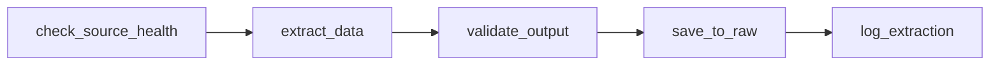

# Data Extraction

**Competencies**: C8 (Automated Extraction), C9 (SQL Queries)
**Evaluation**: E4 (professional report)

---

## Three Extraction Sources

NutriTrack extracts data from 3 distinct source types, each demonstrating a different collection method:

| Source | Method | Script | Frequency | Volume |
|--------|--------|--------|-----------|--------|
| Open Food Facts | REST API | `extract_off_api.py` | Daily @ 02:00 | ~1,000 products/run |
| OFF Parquet Dump | DuckDB on Parquet file | `extract_off_parquet.py` | Weekly (Sun) @ 03:00 | 50,000+ products |
| ANSES / EFSA | Web scraping | `extract_scraping.py` | Monthly (1st) @ 03:00 | Nutritional guidelines |

**Total raw data collected**: 798,177 French products across all sources.


---

## Source 1: REST API (Open Food Facts)

The daily extraction calls the Open Food Facts search API, filtered for French products.

=== "Script Structure"

    ```python
    # extract_off_api.py - simplified structure
    def extract_off_api():
        """Extract French products from OFF REST API."""
        base_url = "https://world.openfoodfacts.org/cgi/search.pl"
        params = {
            "action": "process",
            "tagtype_0": "countries",
            "tag_contains_0": "contains",
            "tag_0": "france",
            "json": True,
            "page_size": 100
        }

        all_products = []
        for page in range(1, max_pages + 1):
            params["page"] = page
            response = requests.get(base_url, params=params,
                                    headers={"User-Agent": "NutriTrack/1.0"})
            response.raise_for_status()
            products = response.json().get("products", [])
            all_products.extend(products)

        save_json(all_products, output_path)
    ```

=== "Key Features"

    - **Pagination**: Iterates through all result pages
    - **Rate limiting**: Respects OFF API guidelines
    - **User-Agent**: Identifies the application per OFF requirements
    - **Error handling**: Retries on transient failures, logs errors
    - **Output**: JSON files in `data/raw/api/`

## Source 2: Parquet via DuckDB

The weekly bulk extraction reads the OFF data dump in Parquet format using DuckDB for efficient columnar queries.

=== "Script Structure"

    ```python
    # extract_off_parquet.py - simplified structure
    def extract_off_parquet():
        """Extract French products from OFF Parquet dump via DuckDB."""
        import duckdb

        conn = duckdb.connect()
        query = """
            SELECT code, product_name, brands, categories,
                   nutriscore_grade, nova_group,
                   energy_kcal_100g, fat_100g, sugars_100g,
                   salt_100g, proteins_100g, fiber_100g
            FROM read_parquet('data/raw/parquet/off_products.parquet')
            WHERE countries_tags LIKE '%france%'
              AND product_name IS NOT NULL
              AND code IS NOT NULL
        """
        df = conn.execute(query).fetchdf()
        df.to_parquet(output_path)
    ```

=== "Key Features"

    - **DuckDB**: In-process OLAP engine, reads Parquet natively
    - **Columnar efficiency**: Only reads needed columns from 200+ available
    - **SQL filtering**: WHERE clause pushdown to Parquet scan
    - **Volume**: Processes 3M+ rows, extracts ~50K French products
    - **Output**: Parquet file in `data/raw/parquet/`

## Source 3: Web Scraping (ANSES/EFSA)

The monthly scraping collects nutritional reference values from French and European health agencies.

=== "Script Structure"

    ```python
    # extract_scraping.py - simplified structure
    def extract_scraping():
        """Scrape nutritional guidelines from ANSES/EFSA."""
        from bs4 import BeautifulSoup

        response = requests.get(target_url)
        soup = BeautifulSoup(response.text, "html.parser")

        guidelines = []
        for table in soup.find_all("table"):
            rows = table.find_all("tr")
            for row in rows[1:]:  # skip header
                cells = row.find_all("td")
                guideline = {
                    "nutrient": cells[0].text.strip(),
                    "rda_value": float(cells[1].text.strip()),
                    "unit": cells[2].text.strip()
                }
                guidelines.append(guideline)

        save_json(guidelines, output_path)
    ```

=== "Key Features"

    - **BeautifulSoup**: HTML table parsing
    - **Fallback values**: Default RDA values if scraping fails
    - **Error handling**: Graceful degradation on unavailable pages
    - **Output**: JSON files in `data/raw/scraping/`

## Airflow DAG Configuration

Each extraction runs as an Airflow DAG with standardized structure:



| DAG | Schedule | SLA | Retries | Alert on Failure |
|-----|----------|-----|---------|-----------------|
| `etl_extract_off_api` | `0 2 * * *` (daily) | 60 min | 3 | Email via MailHog |
| `etl_extract_parquet` | `0 3 * * 0` (Sunday) | 90 min | 2 | Email via MailHog |
| `etl_extract_scraping` | `0 3 1 * *` (1st of month) | 60 min | 2 | Email via MailHog |

## Script Standards (C8)

Every extraction script follows the certification requirements:

| Requirement | Implementation |
|------------|---------------|
| Entry point | `main()` function callable from Airflow |
| Dependency initialization | Imports and config at module level |
| External connections | Parameterized URLs, connection pooling |
| Logic rules | Filtering, pagination, deduplication |
| Error handling | try/except with logging and retry |
| Result saving | Structured output to `data/raw/` |
| Version control | All scripts in Git with commit history |
