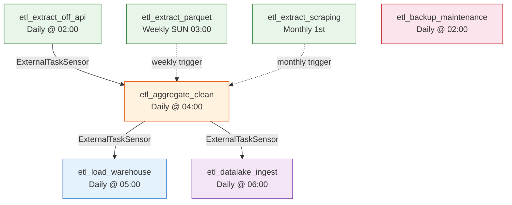
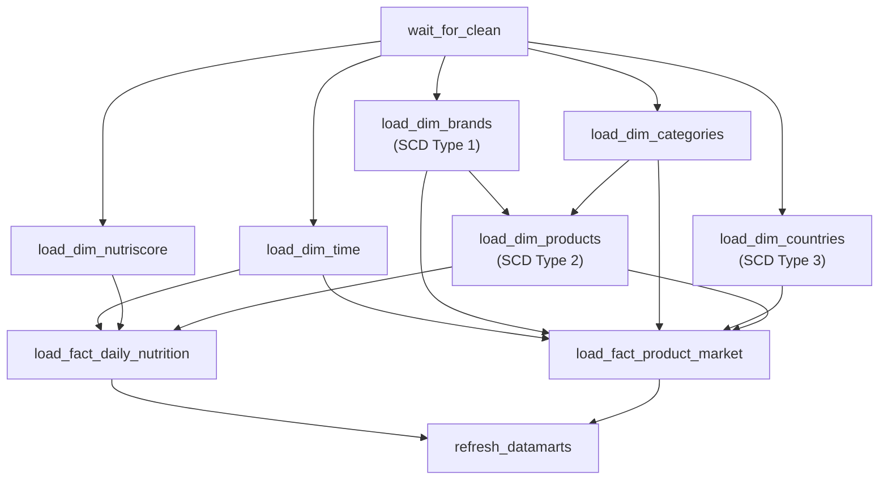
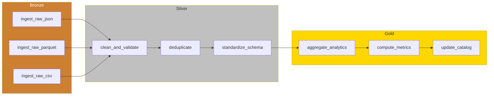
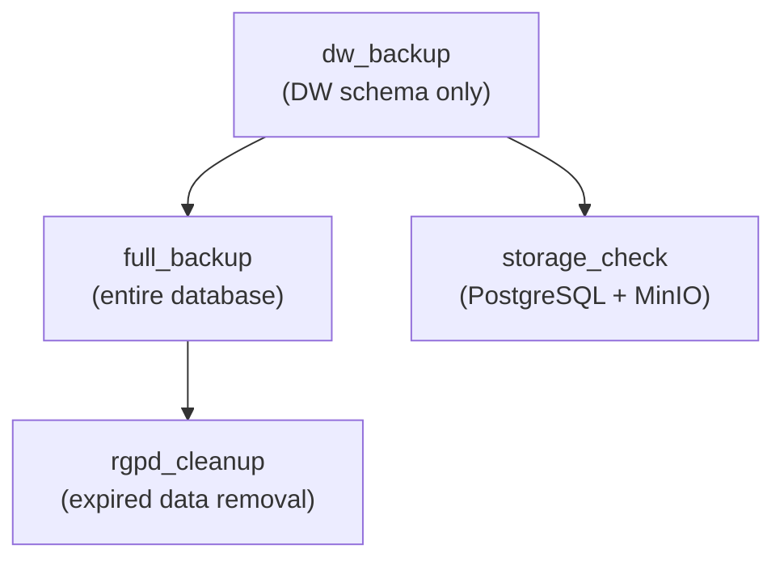

# ETL Pipelines

**Competencies**: C15 (ETL Integration)
**Evaluation**: E5 (professional report)

---

## 7 Airflow DAGs

| # | DAG | Schedule | Purpose |
|---|-----|----------|---------|
| 1 | `etl_extract_off_api` | Daily @ 02:00 | Extract products from OFF REST API |
| 2 | `etl_extract_parquet` | Weekly (Sun) @ 03:00 | Bulk extract from OFF Parquet dump via DuckDB |
| 3 | `etl_extract_scraping` | Monthly (1st) @ 03:00 | Scrape ANSES/EFSA nutritional guidelines |
| 4 | `etl_aggregate_clean` | Daily @ 04:00 | Merge + PySpark 7-rule cleaning pipeline |
| 5 | `etl_load_warehouse` | Daily @ 05:00 | Load star schema (dims then facts, with SCD) |
| 6 | `etl_datalake_ingest` | Daily @ 06:00 | Medallion pipeline (Bronze / Silver / Gold) |
| 7 | `etl_backup_maintenance` | Daily @ 02:00 | Backup + RGPD cleanup + storage checks |

## DAG Dependency Graph

## Pipeline Details

### 1. etl_extract_off_api

- **Source**: Open Food Facts REST API (French products)
- **Output**: `data/raw/api/off_api_*.json`
- **Volume**: ~1,000 products per daily run
- **Features**: Pagination, rate limiting, retry on failure

### 2. etl_extract_parquet

- **Source**: OFF Parquet dump queried via DuckDB
- **Output**: `data/raw/parquet/off_parquet_50k.parquet`
- **Volume**: 50,000+ products per weekly run
- **Features**: Columnar pushdown filtering, SQL on Parquet

### 3. etl_extract_scraping

- **Source**: ANSES/EFSA nutritional guidelines (HTML)
- **Output**: `data/raw/scraping/guidelines_*.json`
- **Features**: BeautifulSoup parsing, fallback RDA values

### 4. etl_aggregate_clean

- **Input**: All raw data files from 3 sources
- **Output**: `data/cleaned/products_cleaned.parquet` + CSV + quality report
- **Engine**: PySpark 3.5 (7 cleaning rules)
- **Volume**: 798,177 in / 777,116 out (2.6% removal)

### 5. etl_load_warehouse

- **Pattern**: Dimensions first, then facts (FK integrity)
- **SCD**: Type 1 (brands), Type 2 (products), Type 3 (countries)
- **Datamarts**: 6 views refreshed after fact loading

### 6. etl_datalake_ingest

- **Storage**: MinIO S3 buckets (bronze / silver / gold)
- **Catalog**: Updates `_catalog/metadata.json` per bucket

### 7. etl_backup_maintenance

- **Backup**: `pg_dump` to MinIO `backups/` bucket
- **RGPD**: Calls `rgpd_cleanup_expired_data()` stored procedure
- **Alerting**: On failure, logs CRITICAL to `etl_activity_log` + email via MailHog

## Data Formats and Volumes

| Pipeline Stage | Format | Volume | Compression |
|---------------|--------|--------|-------------|
| Raw extraction | JSON + Parquet | ~2 GB | None (JSON), Snappy (Parquet) |
| Cleaned output | Parquet + CSV | ~800 MB | Snappy (Parquet), None (CSV) |
| DW load | PostgreSQL tables | ~500 MB | PostgreSQL TOAST |
| Lake Bronze | Original formats | ~2 GB | Varies |
| Lake Silver | Parquet | ~600 MB | Snappy |
| Lake Gold | Parquet | ~100 MB | Snappy |

## Error Handling

All DAGs use standardized callbacks:

| Event | Callback | Alert Level | Action |
|-------|----------|-------------|--------|
| Task failure | `on_failure_callback` | CRITICAL | Log to DB + email via MailHog |
| Task retry | `on_retry_callback` | WARNING | Log to DB |
| SLA miss | `sla_miss_callback` | WARNING | Log to DB + email |
| Task success | `on_success_callback` | INFO | Log to DB |
