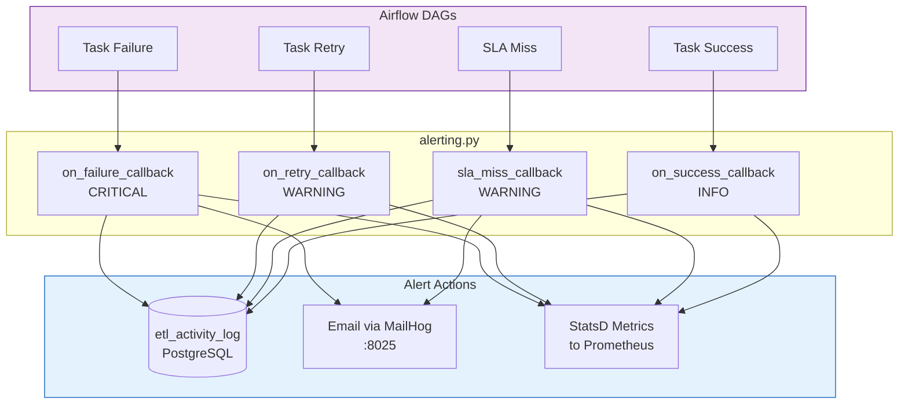
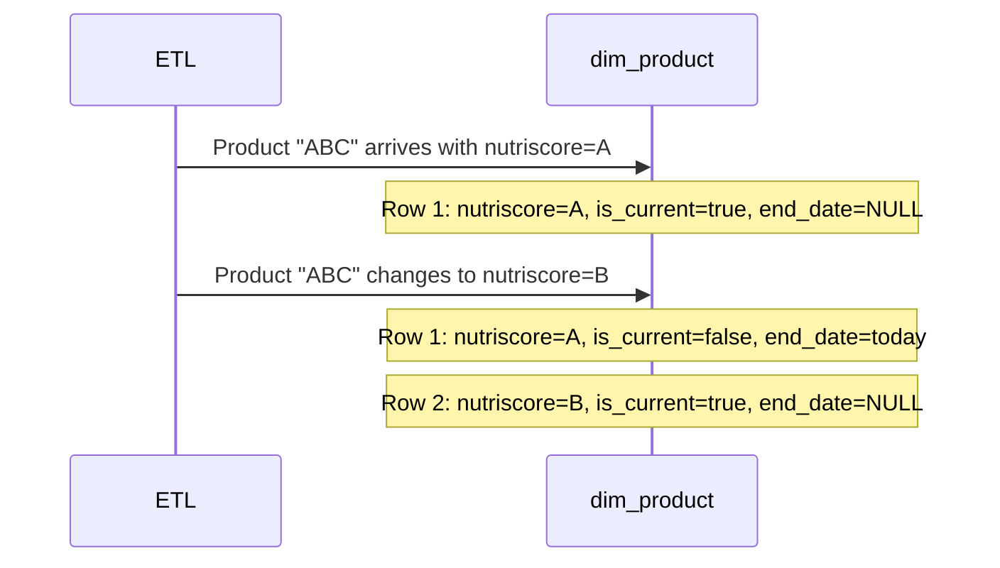
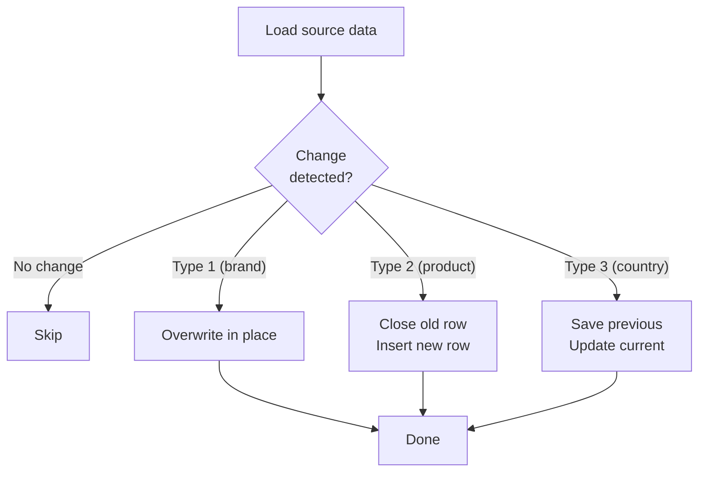

# Maintenance and SCD

**Competencies**: C16 (DW Administration), C17 (Dimension Variations)
**Evaluation**: E6 (professional report)

---

## SLA Indicators (C16)

5 service level indicators tracked on the Grafana SLA Compliance dashboard:

| SLI | Target | Measurement | Source |
|-----|--------|-------------|--------|
| ETL Success Rate | > 95% | `successes / (successes + failures)` | StatsD / Prometheus |
| Data Freshness | < 24 hours | Time since last successful DAG run | StatsD / Prometheus |
| Backup Completion | 100% | Backup task success rate | StatsD / Prometheus |
| Query Response Time | < 5 seconds | PostgreSQL query latency | postgres-exporter |
| Data Completeness | > 80% | Non-null rate for key columns | staging.data_quality_checks |

## Grafana Dashboards

6 dashboards provide full operational visibility:

| Dashboard | Panels | Key Metrics |
|-----------|--------|-------------|
| **Airflow Metrics** | DAG/task overview | Success/failure counts, run durations |
| **Airflow DAGs** | Per-DAG details | Individual DAG performance |
| **PostgreSQL** | DB health | Connections, cache hit ratio, latency |
| **Docker System** | Container resources | CPU, memory, I/O per container |
| **MinIO** | Object store health | Object count, bucket size, requests |
| **SLA Compliance** | Service levels | ETL success, freshness, backups |


## Alert System

### Architecture



### Alert Categories

| Category | Severity | Trigger | Response Time |
|----------|----------|---------|--------------|
| **CRITICAL** | P1 | Task failure, data loss | < 1 hour |
| **WARNING** | P2 | Task retry, SLA miss, storage > 90% | < 4 hours |
| **INFO** | P4 | Task success, routine operations | No action |

### MailHog SMTP

MailHog captures all alert emails during development and demos:

- **SMTP**: `mailhog:1025` (internal) / `localhost:1025` (host)
- **Web UI**: [localhost:8025](http://localhost:8025) -- view all captured alerts
- **From**: `airflow@nutritrack.local`

## Maintenance Priority Matrix (ITIL)

| Priority | Response Time | Examples |
|----------|--------------|---------|
| **P1 -- Critical** | < 1 hour | Database down, data loss, security breach |
| **P2 -- High** | < 4 hours | ETL pipeline failure, SLA breach, storage > 90% |
| **P3 -- Medium** | < 24 hours | Performance degradation, non-critical DAG failure |
| **P4 -- Low** | Next sprint | Documentation update, optimization opportunity |

## Backup Procedures

| Backup Type | Scope | Storage | Retention | Schedule |
|------------|-------|---------|-----------|----------|
| **DW backup** | `dw` schema only | MinIO `backups/dw/` | 30 days | Daily @ 02:00 |
| **Full backup** | Entire database | MinIO `backups/full/` | 30 days | Daily @ 02:00 |

Both use `pg_dump` and upload to MinIO with timestamped filenames. Lifecycle rules auto-delete after 30 days.

## Scalability Procedures

| Operation | Procedure |
|-----------|----------|
| **New data source** | Add extraction DAG, update `etl_aggregate_clean` merge step, update catalog |
| **New access role** | Create PostgreSQL group role, grant schema permissions, add API role check |
| **Add datamart** | Create SQL view in `dw` schema, grant to relevant roles, add to `refresh_datamarts` task |
| **Increase storage** | Expand Docker volume, update MinIO lifecycle rules, adjust Grafana alerts |

---

## Slowly Changing Dimensions (C17)

NutriTrack implements all three Kimball SCD types:

### SCD Type 1 -- Overwrite (dim_brand)

Used for **corrections** where history is not needed.


```sql
UPDATE dw.dim_brand
SET brand_name = NEW.brand_name,
    parent_company = NEW.parent_company,
    last_updated = NOW()
WHERE brand_id = NEW.brand_id
  AND (brand_name IS DISTINCT FROM NEW.brand_name
    OR parent_company IS DISTINCT FROM NEW.parent_company);
```

**When to use**: Typo corrections, data quality fixes where the old value was simply wrong.

### SCD Type 2 -- Historical Tracking (dim_product)

Used for **tracking changes over time** with full history preservation.



**Key columns**: `effective_date`, `end_date`, `is_current`

**Change detection**: Uses `IS DISTINCT FROM` to compare all tracked columns.

### SCD Type 3 -- Previous Value (dim_country)

Used when only the **immediately previous value** needs to be retained.

```sql
UPDATE dw.dim_country
SET previous_country_list = country_list,
    country_list = NEW.country_list,
    last_updated = NOW()
WHERE country_id = NEW.country_id
  AND country_list IS DISTINCT FROM NEW.country_list;
```

**Trade-off**: Only stores one level of history (current + previous), but uses no additional rows.

### SCD Integration into ETL

All SCD operations run inside the `etl_load_warehouse` DAG:



### Variation Documentation

| Dimension | SCD Type | Tracked Columns | History Depth |
|-----------|----------|----------------|---------------|
| `dim_brand` | Type 1 | brand_name, parent_company | Current only |
| `dim_product` | Type 2 | All nutritional values, nutriscore_grade | Full history |
| `dim_country` | Type 3 | country_list | Current + 1 previous |
| `dim_user` | Type 2 | activity_level, age_group | Full history |

!!! warning "Type 2 Growth"
    `dim_product` with Type 2 SCD can grow unbounded. The `dm_dw_health` datamart monitors row counts and flags excessive growth.
