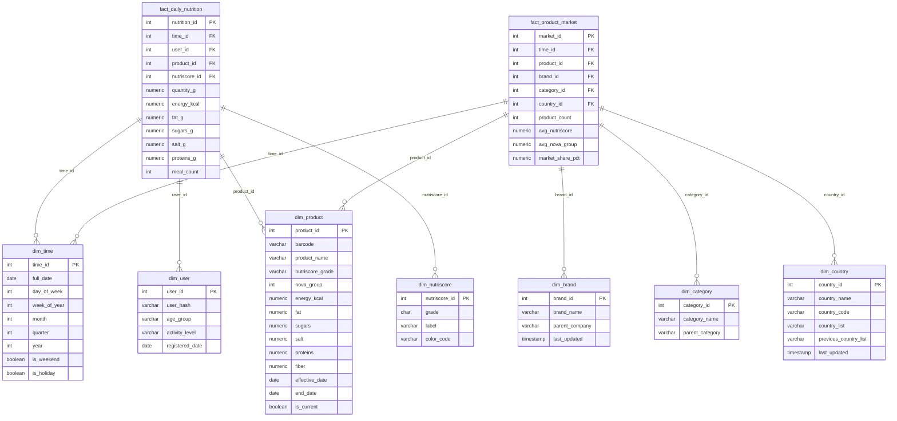
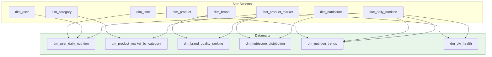

# Star Schema

**Competencies**: C13 (Star Schema Modeling), C14 (Data Warehouse Creation)
**Evaluation**: E5 (professional report)

---

## Design Approach

The data warehouse follows a **bottom-up (Kimball)** methodology:

1. **Business requirements first** -- analytics needs drove the schema design
2. **Dimensional modeling** -- star schema for optimal query performance
3. **Incremental delivery** -- datamarts built as analytical views on top
4. **Conformed dimensions** -- shared across both fact tables

!!! tip "Why Bottom-Up?"
    The Kimball bottom-up approach was chosen because business requirements were well-defined from the start (nutrition tracking, product analytics). This enabled rapid delivery of functional datamarts without waiting for a full enterprise data model (top-down / Inmon approach).

## Entity Relationship Diagram

## Dimension Tables

| Dimension | Rows | SCD Type | Key Business Use |
|-----------|------|----------|-----------------|
| `dim_time` | ~7,300 | N/A (pre-populated 20 years) | Date-based analysis, weekday/weekend, holidays |
| `dim_product` | ~777K | **Type 2** (historical) | Product evolution tracking, nutriscore changes |
| `dim_brand` | ~5,000 | **Type 1** (overwrite) | Brand name corrections, parent company |
| `dim_category` | ~500 | Static | Product classification hierarchy |
| `dim_country` | ~200 | **Type 3** (previous value) | Country distribution changes |
| `dim_user` | Anonymized | Static | User nutrition patterns (SHA256 hash, no PII) |
| `dim_nutriscore` | 5 | Static | A--E grade lookup with labels and color codes |

## Fact Tables

| Fact | Grain | Measures | Refresh |
|------|-------|----------|---------|
| `fact_daily_nutrition` | 1 row per user per product per day | energy_kcal, fat_g, sugars_g, salt_g, proteins_g, meal_count | Daily |
| `fact_product_market` | 1 row per product per brand per category per country per day | product_count, avg_nutriscore, avg_nova_group, market_share_pct | Daily |

## Datamart Views

6 views provide pre-aggregated data for specific analytical needs:

| Datamart | Purpose | Key Metrics | Primary Consumer |
|----------|---------|-------------|-----------------|
| `dm_user_daily_nutrition` | User meal tracking | Daily calories, macros, meal count | Streamlit (user role) |
| `dm_product_market_by_category` | Category analysis | Product count, avg nutriscore per category | Streamlit (analyst role) |
| `dm_brand_quality_ranking` | Brand comparison | Avg nutriscore, avg NOVA, product count per brand | Streamlit (analyst role) |
| `dm_nutriscore_distribution` | Grade distribution | Count of products per Nutri-Score grade | Streamlit (analyst role) |
| `dm_nutrition_trends` | Temporal patterns | Weekly/monthly nutrition aggregates | Streamlit (analyst role) |
| `dm_dw_health` | Warehouse monitoring | Row counts, freshness, SCD status | Grafana / SLA dashboard |

## Access Control

| Role | Access Level |
|------|-------------|
| `app_readonly` | SELECT on all datamarts |
| `nutritionist_role` | SELECT on nutrition + product datamarts |
| `admin_role` | SELECT on all datamarts + all DW tables |

## Data Needed for Analyses

An exhaustive list of data required, mapped to source:

| Analysis Need | Required Data | Source |
|--------------|--------------|--------|
| Daily nutrition tracking | User meals, product nutrients, time | app.meals + app.products |
| Product quality by brand | Products, brands, nutriscore, NOVA | app.products (cleaned) |
| Category market analysis | Products, categories, countries | app.products (cleaned) |
| Nutri-Score distribution | Products, nutriscore grades | app.products (cleaned) |
| Nutrition trends over time | Daily aggregates, time periods | fact_daily_nutrition + dim_time |
| DW health monitoring | Table row counts, freshness | All DW tables (metadata) |
