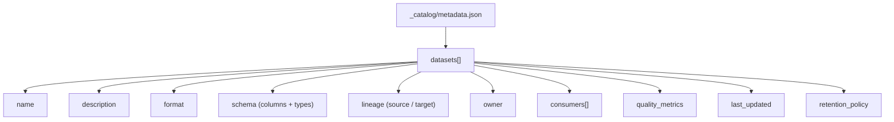
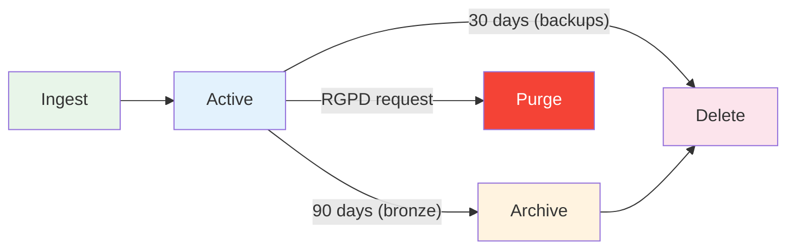
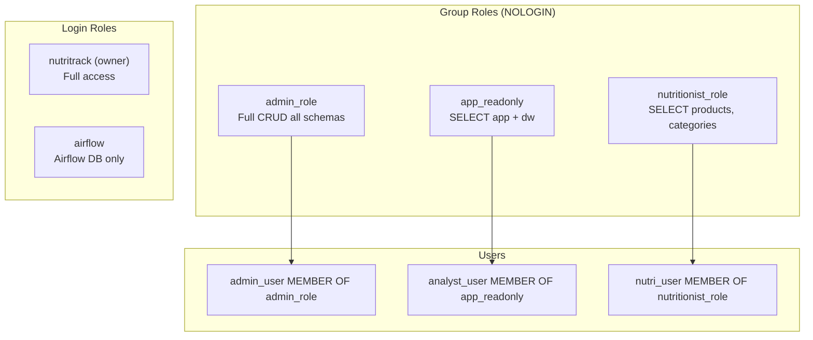
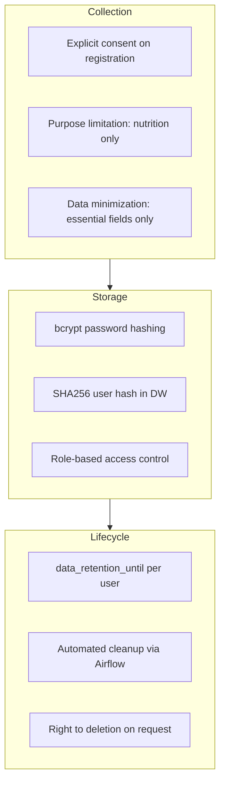

# Catalog and Governance

**Competencies**: C20 (Data Catalog), C21 (Data Governance)
**Evaluation**: E7 (professional report)

---

## Data Catalog (C20)

Each MinIO bucket contains a `_catalog/metadata.json` file with dataset descriptions, schemas, lineage, and ownership.

### Catalog Entry Structure



### Sample Entry

```json
{
  "catalog_version": "1.0",
  "last_updated": "2026-04-06T06:00:00Z",
  "datasets": [
    {
      "name": "products_cleaned",
      "description": "Deduplicated, validated product dataset (777,116 records)",
      "format": "parquet",
      "location": "silver/products/products_cleaned.parquet",
      "schema": {
        "barcode": "string",
        "product_name": "string",
        "nutriscore_grade": "string (A-E)",
        "energy_kcal_100g": "float",
        "fat_100g": "float",
        "sugars_100g": "float"
      },
      "lineage": {
        "sources": [
          "bronze/products/off_api_*.json",
          "bronze/products/off_parquet_*.parquet"
        ],
        "transformation": "etl_aggregate_clean (PySpark)",
        "dag": "etl_datalake_ingest"
      },
      "owner": "data-platform",
      "consumers": ["etl_load_warehouse", "fastapi"],
      "quality_metrics": {
        "row_count": 777116,
        "null_rate": 0.02,
        "duplicate_rate": 0.0
      },
      "retention": "indefinite",
      "last_updated": "2026-04-06T06:00:00Z"
    }
  ]
}
```

### Catalog Update Process

The `update_catalog` task in the `etl_datalake_ingest` DAG automatically updates metadata after each run:

1. Counts objects and total size per bucket
2. Updates `row_count` and `null_rate` from quality checks
3. Sets `last_updated` timestamp
4. Writes updated JSON to `_catalog/metadata.json`

## Lifecycle Management



| Bucket | Retention | Policy | Implementation |
|--------|-----------|--------|---------------|
| `bronze` | 90 days | Auto-delete via MinIO lifecycle rule | `minio-init` sets ILM rule |
| `silver` | Indefinite | Manual cleanup only | No auto-expiry |
| `gold` | Indefinite | Manual cleanup only | No auto-expiry |
| `backups` | 30 days | Auto-delete via MinIO lifecycle rule | `minio-init` sets ILM rule |

### Deletion Procedures

| Trigger | Scope | Procedure |
|---------|-------|----------|
| **Lifecycle rule** | Bronze objects > 90 days | Automatic MinIO ILM deletion |
| **Lifecycle rule** | Backup objects > 30 days | Automatic MinIO ILM deletion |
| **RGPD request** | Specific user data | Manual purge + log to etl_activity_log |
| **Manual cleanup** | Silver/Gold stale data | Operator decision, logged |

## Monitoring (C20)

The `check_storage_status()` task in `etl_datalake_ingest` reports:

- Object count per bucket
- Total size per bucket
- Last modified timestamp
- Alerts on disk space > 80% threshold

MinIO alert rules are configured in Prometheus to trigger Grafana notifications on:

- Bucket size exceeding thresholds
- Failed object uploads
- S3 API error rates

---

## Access Rights Matrix (C21)

Rights are applied to **groups** (not individuals) following the principle of least privilege:

| Group | PostgreSQL | FastAPI | MinIO | Streamlit |
|-------|-----------|---------|-------|-----------|
| **admin** | `admin_role`: Full CRUD on all schemas | All endpoints | `readwrite`: Full access all buckets | 8 pages (full access) |
| **data_engineer** | `nutritrack` (owner): Full CRUD | N/A (backend only) | `readwrite`: Full access all buckets | N/A |
| **analyst** | `app_readonly`: SELECT on app + dw schemas | Analytics endpoints | `readonly`: Read silver + gold | 7 pages (analytics) |
| **nutritionist** | `nutritionist_role`: SELECT on products/categories | Patient + product endpoints | `readonly`: Read gold only | 7 pages (patient care) |
| **user** | No direct access | Own meals + product search | No access | 6 pages (personal tracking) |

### PostgreSQL Role Hierarchy



**Principle**: Users inherit permissions via `GRANT role TO user`. No permissions are granted directly to individual users.

### MinIO Access Policies

| Policy | Buckets | Operations |
|--------|---------|-----------|
| `readwrite` | All (bronze, silver, gold, backups) | GetObject, PutObject, DeleteObject, ListBucket |
| `readonly` | silver, gold | GetObject, ListBucket |
| `public` (gold analytics) | gold/analytics/ | GetObject only |

### API Authorization

| Endpoint | Required Role | Enforcement |
|----------|--------------|------------|
| `POST /auth/register` | None | Public |
| `POST /auth/login` | None | Public |
| `GET /products/*` | `user` | `@require_role("user")` decorator |
| `GET /meals/*` | `user` | Own data only (user_id from JWT) |
| `POST /meals/` | `user` | Own data only |
| `GET /auth/me` | `user` | Own profile only |

---

## RGPD Compliance

### Personal Data Registry

Stored in `app.rgpd_data_registry`:

| Data Category | Legal Basis | Retention Period | Security Measures |
|--------------|-------------|-----------------|-------------------|
| User identity (email, name) | Consent | 2 years after last activity | bcrypt hash, role-based access |
| Meal logs | Consent | 2 years | Row-level access, anonymized in DW |
| Health data (nutrition) | Consent | 2 years | Encrypted at rest, role-based access |
| Usage logs | Legitimate interest | 1 year | Aggregated, no PII |

### RGPD Measures



### Sorting and Deletion Procedures

| Procedure | Trigger | Action |
|-----------|---------|--------|
| **Automated cleanup** | Daily via `etl_backup_maintenance` | Delete meals past retention; deactivate expired users |
| **Right to erasure** | User request | Delete all user data + meals; anonymize DW records |
| **Consent withdrawal** | User action | Deactivate account; schedule data deletion |
| **Bronze lifecycle** | 90-day MinIO rule | Auto-delete raw data objects |
| **Backup lifecycle** | 30-day MinIO rule | Auto-delete old backups |

!!! warning "Health Data"
    Nutritional tracking data is considered health-related under RGPD. Extra safeguards apply: explicit consent required, anonymization in the data warehouse, and strict role-based access.
