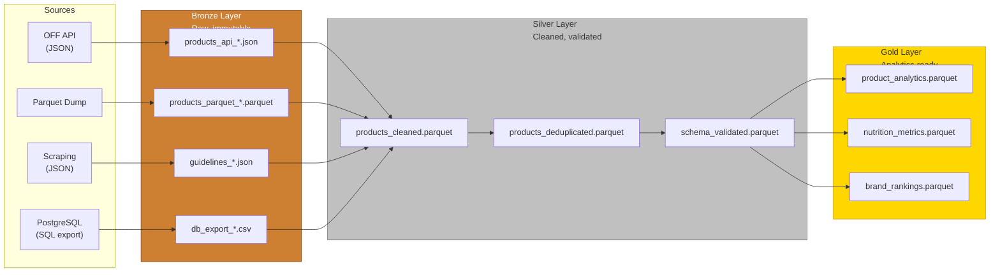
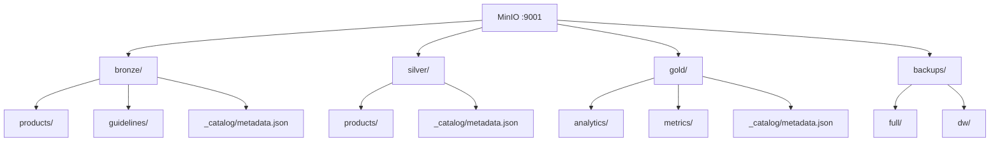

# Medallion Architecture

**Competencies**: C18 (Data Lake Architecture), C19 (Infrastructure Integration)
**Evaluation**: E7 (professional report)

---

## Architecture Design (C18)

The data lake uses a **medallion architecture** (Bronze / Silver / Gold) on MinIO, an S3-compatible object store. This layered approach separates raw ingestion from cleaned and aggregated data.

## Layer Details

### Bronze -- Raw Data

| Property | Value |
|----------|-------|
| **MinIO Bucket** | `bronze` |
| **Format** | Original format (JSON, Parquet, CSV) |
| **Treatment** | None -- data stored as-is for audit and reprocessing |
| **Retention** | 90 days (MinIO lifecycle rule auto-deletes) |
| **Purpose** | Audit trail, reprocessing capability, data lineage |

### Silver -- Cleaned Data

| Property | Value |
|----------|-------|
| **MinIO Bucket** | `silver` |
| **Format** | Parquet (columnar, Snappy compressed) |
| **Treatment** | Deduplication, schema validation, type casting, null handling |
| **Retention** | Indefinite |
| **Purpose** | Single source of truth for clean data |

### Gold -- Analytics-Ready

| Property | Value |
|----------|-------|
| **MinIO Bucket** | `gold` |
| **Format** | Parquet (optimized for analytics) |
| **Treatment** | Aggregation, metric computation, business logic |
| **Retention** | Indefinite |
| **Purpose** | Direct consumption by analytics and reporting tools |

## MinIO Bucket Structure

## Volume, Velocity, Variety (3V)

| Constraint | Challenge | Solution |
|-----------|-----------|----------|
| **Volume** | 798K+ French products; OFF dump has 3M+ total | DuckDB for columnar analytics on Parquet; Snappy compression |
| **Variety** | JSON (API, scraping), Parquet (dump), CSV (DB export) | Bronze layer accepts all formats; Silver normalizes to Parquet |
| **Velocity** | Daily incremental + weekly bulk + monthly scraping | Airflow schedules: API daily, Parquet weekly, scraping monthly |

## Feed Methods Per Source

| Source | Feed Method | Justification | Frequency |
|--------|-----------|---------------|-----------|
| OFF API | REST API pull | Daily incremental updates, rate-limited | Daily |
| OFF Parquet | File download + DuckDB | Bulk weekly update, pre-formatted columnar data | Weekly |
| ANSES/EFSA | Web scraping | No API available, structured HTML tables | Monthly |
| PostgreSQL | SQL export to CSV | Direct access, schema-aware, full snapshot | Daily |

## Catalog Tool Comparison (C18)

| Criteria | Apache Atlas | DataHub | Custom JSON Catalog |
|----------|-------------|---------|-------------------|
| Setup complexity | High (HBase + Solr) | Medium (Docker) | Low |
| Resource usage | 4 GB+ RAM | 2 GB+ RAM | Negligible |
| Search capability | Full-text | Full-text | Basic JSON |
| Lineage tracking | Built-in | Built-in | Manual |
| MinIO integration | Plugin | Plugin | Native (S3 API) |
| **Selected** | | | **Yes** |

!!! info "Catalog Choice"
    The custom JSON catalog was selected for its minimal resource overhead, direct MinIO integration via the S3 API, and sufficiency at project scale. Each bucket contains a `_catalog/metadata.json` file co-located with the data.

## Infrastructure Integration (C19)

All data lake components are installed and configured via Docker Compose:

| Component | Installation | Configuration |
|-----------|-------------|--------------|
| **MinIO** | `minio/minio:latest` Docker image | 4 buckets created by `minio-init` container |
| **Airflow** | Custom image with PySpark 3.5 | `etl_datalake_ingest` DAG with Bronze/Silver/Gold tasks |
| **Catalog** | JSON files in each bucket | Updated by `update_catalog` task in DAG |

!!! tip "Reproducibility"
    The `minio-init` container automatically creates all 4 buckets (bronze, silver, gold, backups) and sets lifecycle rules on startup. No manual MinIO configuration is needed.
