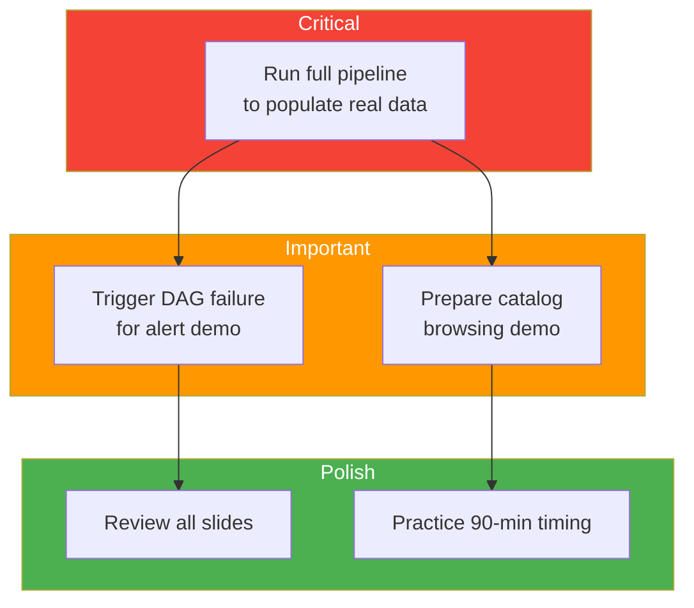

# Audit Report

## Summary

Automated codebase audit against all 21 competencies of the RNCP37638 Data Engineer certification.

**Audit Date**: 2026-03-15
**Result**: 17 FULL, 4 PARTIAL, 0 MISSING

For the full detailed audit report, see [`docs/certification_audit.md`](https://github.com/Reetika12795/NutriTrack/blob/main/nutritrack/docs/certification_audit.md) in the repository.

## Gap Summary

### C4 — Technical Monitoring (PARTIAL)

**Gap**: Newsletter could be more comprehensive with regular schedule evidence.
**Evidence**: `docs/veille_technologique.md` covers Superset 6.0, GDPR updates, Airflow 2.8.
**Fix**: Demonstrate regular monitoring cadence during defense.

### C6 — Project Supervision (PARTIAL)

**Gap**: Indicators not demonstrably updated throughout project lifecycle.
**Evidence**: `etl_activity_log` table with 22 seed entries spanning 14 days.
**Fix**: Run pipelines before demo to populate real historical data.

### C16 — DW Administration (PARTIAL)

**Gap**: SMTP alerts need live demo verification; SLA dashboard newly added.
**Evidence**: MailHog SMTP configured, `alerting.py` callbacks, `sla-compliance.json` dashboard.
**Fix**: Trigger a DAG failure during demo to show alert flow.

### C20 — Data Catalog (PARTIAL)

**Gap**: Catalog is JSON-based, lacks interactive search UI.
**Evidence**: `_catalog/metadata.json` in each MinIO bucket, updated by ETL.
**Fix**: Demonstrate catalog via MinIO Console + JSON browsing, or add Streamlit page.

## Priority Actions Before Defense

