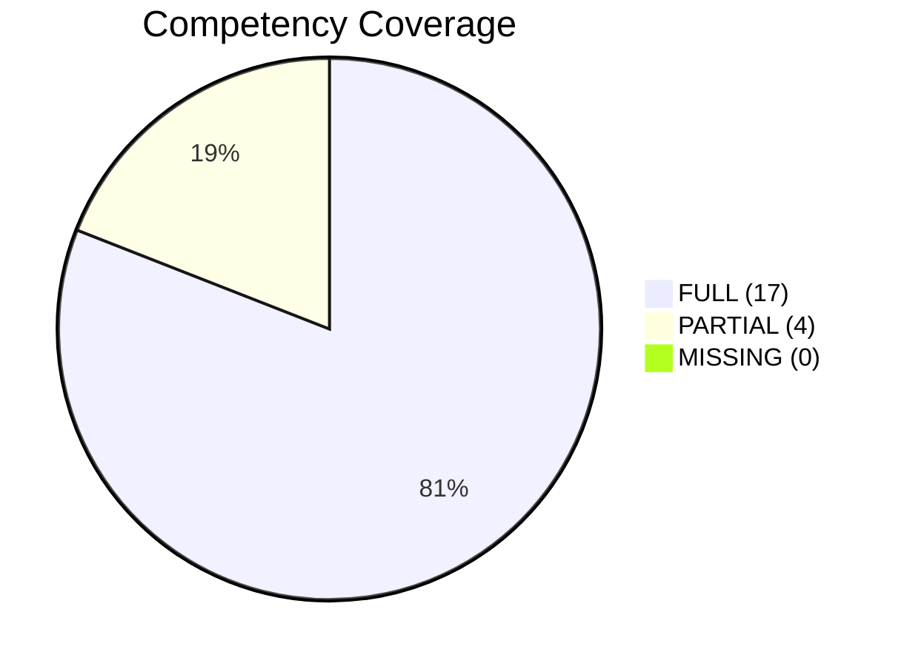
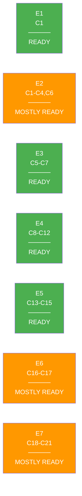

# Competency Matrix

## RNCP37638 — Expert en infrastructures de donnees massives

21 competencies across 4 blocks, evaluated in 7 evaluations.

## Coverage Overview

## Block 1: Steer a Data Project

| ID | Competency | Status | Evidence |
|----|-----------|--------|----------|
| **C1** | Analyze data project need expression | FULL | Interview grids (producers + consumers), synthesis note |
| **C2** | Map available data (data topography) | FULL | 4-part topography: semantics, models, flows, access |
| **C3** | Design technical exploitation framework | FULL | Architecture study, flux matrix, RGPD, eco-responsibility |
| **C4** | Technical and regulatory monitoring | PARTIAL | Monitoring newsletter (`veille_technologique.md`) |
| **C5** | Plan data project execution | FULL | Roadmap, calendar, effort weighting (Fibonacci) |
| **C6** | Supervise data project execution | PARTIAL | Airflow UI, etl_activity_log (needs populated data) |
| **C7** | Project communication strategy | FULL | Multi-stakeholder communication plan |

## Block 2: Data Collection, Storage & Sharing

| ID | Competency | Status | Evidence |
|----|-----------|--------|----------|
| **C8** | Automate data extraction | FULL | 5 source types: REST API, Parquet, scraping, DB, DuckDB |
| **C9** | SQL extraction queries | FULL | 7 optimized queries with EXPLAIN ANALYZE |
| **C10** | Data aggregation rules | FULL | Multi-source merge, dedup, cleaning pipeline |
| **C11** | RGPD-compliant database | FULL | MERISE models, PostgreSQL, RGPD registry |
| **C12** | REST API for data sharing | FULL | FastAPI, JWT, RBAC, OpenAPI docs |

## Block 3: Data Warehouse

| ID | Competency | Status | Evidence |
|----|-----------|--------|----------|
| **C13** | Star schema modeling | FULL | 7 dimensions, 2 facts, bottom-up justified |
| **C14** | Data warehouse creation | FULL | Docker-based, Superset access, test procedures |
| **C15** | ETL integration | FULL | 6 Airflow DAGs, SCD, ExternalTaskSensor |
| **C16** | DW administration & supervision | PARTIAL | Alerting plugin, SLA dashboard, MailHog SMTP |
| **C17** | Dimension variations (SCD) | FULL | Type 1 (brand), Type 2 (product), Type 3 (country) |

## Block 4: Data Lake

| ID | Competency | Status | Evidence |
|----|-----------|--------|----------|
| **C18** | Data lake architecture design | FULL | Medallion, V/V/V analysis, catalog comparison |
| **C19** | Infrastructure component integration | FULL | MinIO, Airflow, Docker Compose |
| **C20** | Data catalog management | PARTIAL | JSON catalog (no interactive UI) |
| **C21** | Data governance rules | FULL | Group-based RBAC, least privilege, RGPD |

## Evaluation Readiness

## Competency-to-Evaluation Map

| Evaluation | Type | Competencies | Duration |
|-----------|------|-------------|----------|
| **E1** | Case Study | C1 | 5 min |
| **E2** | Professional Situation | C1, C2, C3, C4, C6 | 20 min |
| **E3** | Role Play | C5, C6, C7 | 10 min |
| **E4** | Professional Situation | C8, C9, C10, C11, C12 | 15 min |
| **E5** | Professional Situation | C13, C14, C15 | 10 min |
| **E6** | Case Study | C16, C17 | 5-10 min Q&A |
| **E7** | Professional Situation | C18, C19, C20, C21 | 10 min |
