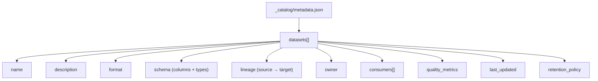
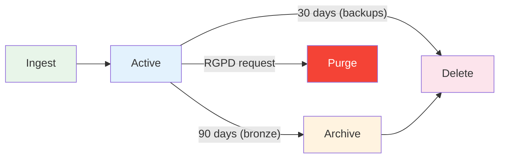

# Data Catalog

## Catalog Management (C20)

Each MinIO bucket contains a `_catalog/metadata.json` file with dataset descriptions, schemas, lineage, and ownership information.

## Catalog Structure



## Sample Catalog Entry

```json
{
  "catalog_version": "1.0",
  "last_updated": "2026-03-15T06:00:00Z",
  "datasets": [
    {
      "name": "products_cleaned",
      "description": "Deduplicated, validated product dataset",
      "format": "parquet",
      "location": "silver/products/products_cleaned.parquet",
      "schema": {
        "barcode": "string",
        "product_name": "string",
        "nutriscore_grade": "string (A-E)",
        "energy_kcal_100g": "float",
        "fat_100g": "float",
        "sugars_100g": "float"
      },
      "lineage": {
        "sources": ["bronze/products/off_api_*.json", "bronze/products/off_parquet_*.parquet"],
        "transformation": "aggregate_clean.py",
        "dag": "etl_datalake_ingest"
      },
      "owner": "data-platform",
      "consumers": ["etl_load_warehouse", "superset", "fastapi"],
      "quality_metrics": {
        "row_count": 48523,
        "null_rate": 0.02,
        "duplicate_rate": 0.0
      },
      "retention": "indefinite",
      "last_updated": "2026-03-15T06:00:00Z"
    }
  ]
}
```

## Feed Methods Per Source

| Source | Feed Method | Justification | Script |
|--------|-----------|---------------|--------|
| OFF API | REST API pull | Daily incremental, rate-limited | `extract_off_api.py` |
| OFF Parquet | S3 download | Bulk weekly update, pre-formatted | `extract_off_parquet.py` |
| ANSES/EFSA | Web scraping | No API available, structured HTML | `extract_scraping.py` |
| PostgreSQL | SQL export | Direct access, schema-aware | `extract_from_db.py` |
| DuckDB analytics | SQL query | Columnar analytics on Parquet | `extract_duckdb.py` |

## Lifecycle Management



| Bucket | Retention | Policy |
|--------|-----------|--------|
| `bronze` | 90 days | Lifecycle rule auto-deletes old objects |
| `silver` | Indefinite | Manual cleanup only |
| `gold` | Indefinite | Manual cleanup only |
| `backups` | 30 days | Lifecycle rule auto-deletes old backups |

## Monitoring

The `etl_datalake_ingest` DAG includes a `check_storage_status()` task that reports:

- Object count per bucket
- Total size per bucket
- Last modified timestamp
- Alerts on disk space > 80% threshold
