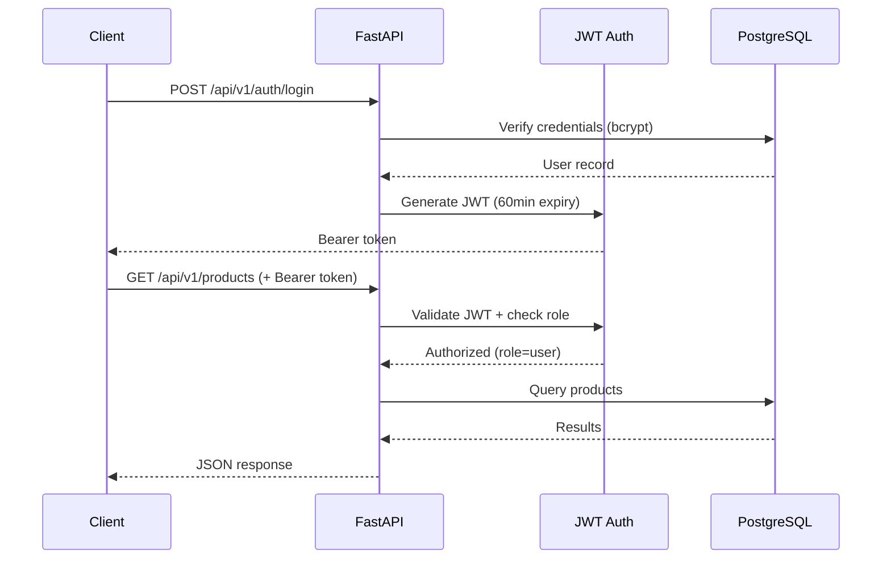
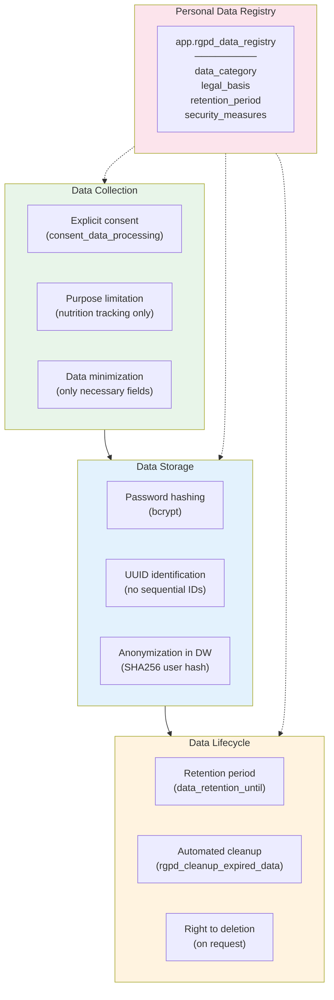

# Governance & RGPD

## Data Governance (C21)

Access control is enforced at every layer: PostgreSQL, MinIO, FastAPI, and Superset.

## Access Control Architecture

```mermaid
graph TD
    subgraph Users["User Groups"]
        A["Admin"]
        DE["Data Engineer"]
        AN["Analyst"]
        NU["Nutritionist"]
        U["End User"]
    end

    subgraph PG["PostgreSQL"]
        AR["admin_role"]
        NR["nutritrack (owner)"]
        RO["app_readonly"]
        NUR["nutritionist_role"]
    end

    subgraph API["FastAPI"]
        AA["admin"]
        AU["user"]
        ANU["nutritionist"]
    end

    subgraph MN["MinIO"]
        RW["readwrite policy"]
        R["readonly policy"]
        PUB["public (gold)"]
    end

    subgraph SS["Superset"]
        SAD["Admin"]
        SAL["Alpha"]
        SAN["Analyst"]
        SNU["Nutritionist"]
    end

    A --> AR & AA & RW & SAD
    DE --> NR & RW
    AN --> RO & R & SAN
    NU --> NUR & ANU & R & SNU
    U --> AU & PUB

    style Users fill:#e8f5e9,stroke:#2e7d32
    style PG fill:#e3f2fd,stroke:#1565c0
    style API fill:#fff3e0,stroke:#e65100
    style MN fill:#f3e5f5,stroke:#6a1b9a
    style SS fill:#fce4ec,stroke:#c62828
```

## PostgreSQL Roles (Group-Based)

| Role | Type | Permissions |
|------|------|------------|
| `nutritrack` | Login | Owner of all schemas, full CRUD |
| `admin_role` | Group (NOLOGIN) | SELECT/INSERT/UPDATE/DELETE on all tables |
| `nutritionist_role` | Group (NOLOGIN) | SELECT on products, categories, brands; NO access to users |
| `app_readonly` | Group (NOLOGIN) | SELECT only on app + dw schemas |
| `airflow` | Login | Full access to airflow database only |

**Principle**: Rights applied to groups, not individuals. Users inherit via `GRANT role TO user`.

## API Authentication & Authorization

| Endpoint | Required Role | Access |
|----------|--------------|--------|
| `POST /auth/register` | None | Public |
| `POST /auth/login` | None | Public |
| `GET /products/*` | `user` | Authenticated users |
| `GET /meals/*` | `user` | Own meals only |
| `POST /meals/` | `user` | Create own meals |
| `GET /auth/me` | `user` | Own profile |

## RGPD Compliance

### Personal Data Registry

| Data Category | Legal Basis | Retention | Security |
|--------------|-------------|-----------|----------|
| User identity (email, name) | Consent | 2 years after last activity | bcrypt hash, TLS |
| Meal logs | Consent | 2 years | Row-level access, anonymized in DW |
| Health data (nutrition) | Consent | 2 years | Encrypted at rest, role-based access |
| Usage logs | Legitimate interest | 1 year | Aggregated, no PII |

### Automated Cleanup

The `rgpd_cleanup_expired_data()` PostgreSQL function runs daily via Airflow:

1. Deletes meals older than 2 years
2. Deactivates users past their retention date
3. Logs cleanup actions to `etl_activity_log`
