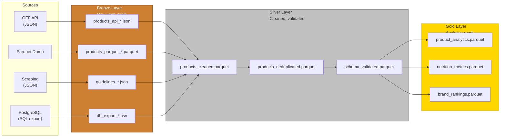
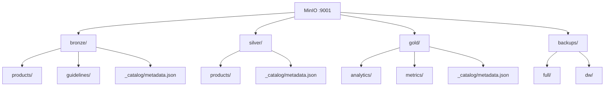

# Medallion Architecture

## Overview (C18, C19)

The data lake uses a **medallion architecture** (Bronze → Silver → Gold) on MinIO, an S3-compatible object store.

## Layer Details

### Bronze — Raw Data

| Property | Value |
|----------|-------|
| **MinIO Bucket** | `bronze` |
| **Format** | Original format (JSON, Parquet, CSV) |
| **Treatment** | None — data stored as-is |
| **Retention** | 90 days (lifecycle rule) |
| **Purpose** | Audit trail, reprocessing capability |

### Silver — Cleaned Data

| Property | Value |
|----------|-------|
| **MinIO Bucket** | `silver` |
| **Format** | Parquet (columnar, compressed) |
| **Treatment** | Deduplication, schema validation, type casting, null handling |
| **Retention** | Indefinite |
| **Purpose** | Single source of truth for clean data |

### Gold — Analytics-Ready

| Property | Value |
|----------|-------|
| **MinIO Bucket** | `gold` |
| **Format** | Parquet (optimized for analytics) |
| **Treatment** | Aggregation, metric computation, business logic |
| **Retention** | Indefinite |
| **Purpose** | Direct consumption by analytics tools |

## MinIO Bucket Structure

## Volume / Velocity / Variety (V/V/V)

| Constraint | Challenge | Solution |
|-----------|-----------|----------|
| **Volume** | 3M+ products in OFF dump | DuckDB for columnar analytics, Parquet for compression |
| **Variety** | JSON, Parquet, CSV, SQL | Bronze layer accepts all formats; Silver normalizes to Parquet |
| **Velocity** | Daily incremental + weekly bulk | Airflow schedules: API daily, Parquet weekly, scraping monthly |

## Catalog Tool Comparison (C18)

| Criteria | Apache Atlas | DataHub | Custom JSON |
|----------|-------------|---------|-------------|
| Setup complexity | High (HBase + Solr) | Medium (Docker) | Low |
| Resource usage | 4GB+ RAM | 2GB+ RAM | Negligible |
| Search capability | Full-text | Full-text | Basic JSON |
| Lineage tracking | Built-in | Built-in | Manual |
| MinIO integration | Plugin | Plugin | Native (S3 API) |
| **Selected** | | | **Yes** |

**Justification**: Custom JSON catalog chosen for minimal overhead, direct MinIO integration, and project-scale sufficiency. The catalog metadata is co-located with the data in each bucket.
