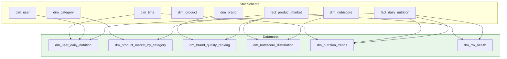

# Datamarts

## Analytics Views

6 datamart views provide pre-aggregated data for specific analytical needs, built on top of the star schema.

## Datamart Details

| Datamart | Purpose | Key Metrics | Consumer |
|----------|---------|-------------|----------|
| `dm_user_daily_nutrition` | User meal tracking | Daily calories, macros, meal count | Streamlit app |
| `dm_product_market_by_category` | Category analysis | Product count, avg nutriscore per category | Superset |
| `dm_brand_quality_ranking` | Brand comparison | Avg nutriscore, avg NOVA, product count per brand | Superset |
| `dm_nutriscore_distribution` | Grade distribution | Count of products per Nutri-Score grade | Superset |
| `dm_nutrition_trends` | Temporal patterns | Weekly/monthly nutrition aggregates | Superset |
| `dm_dw_health` | Warehouse monitoring | Row counts, freshness, SCD status | Grafana / SLA |

## Access Control

Datamarts are accessible through role-based views:

| Role | Access Level |
|------|-------------|
| `app_readonly` | SELECT on all datamarts |
| `nutritionist_role` | SELECT on nutrition + product datamarts |
| `admin_role` | SELECT on all datamarts + DW tables |
| Superset | Connects as `app_readonly` to `dw` schema |
