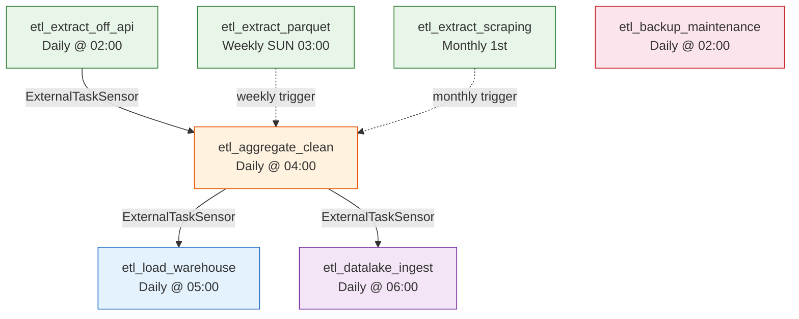
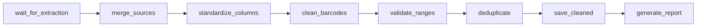
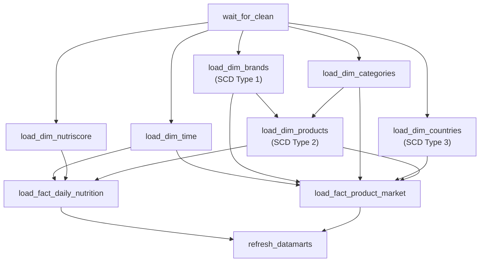
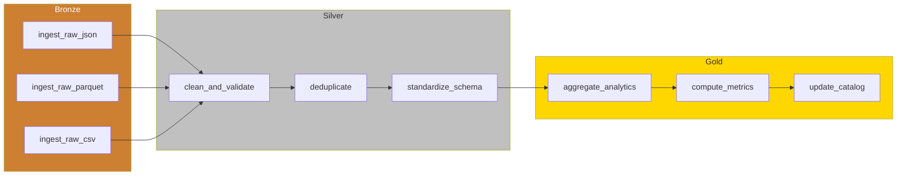
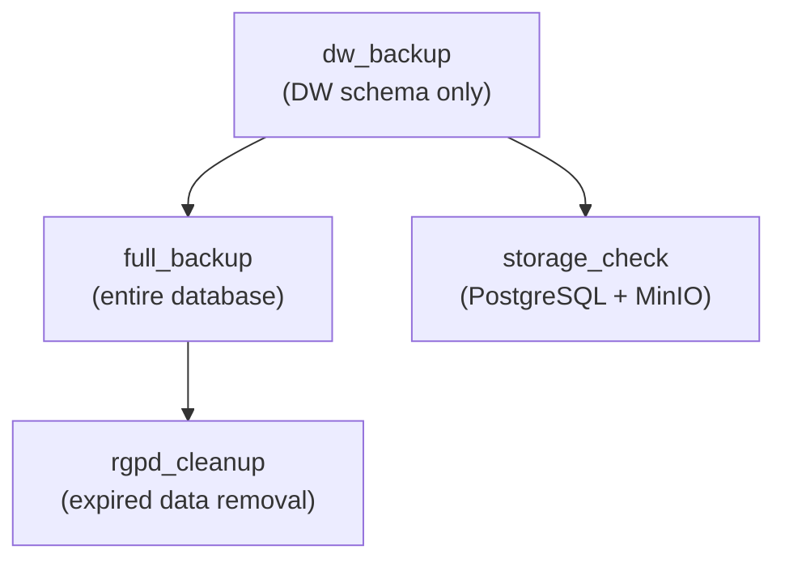

# ETL Pipelines

## Airflow DAG Overview

7 DAGs orchestrate the full data pipeline, from extraction to warehouse loading and data lake ingestion.

```mermaid
gantt
    title Daily ETL Schedule (UTC)
    dateFormat HH:mm
    axisFormat %H:%M

    section Extraction
    OFF API Extract       :api, 02:00, 60min
    Parquet Extract (SUN) :pq, 03:00, 90min
    Scraping (1st of month):sc, 03:00, 60min

    section Transform
    Aggregate & Clean     :clean, 04:00, 45min

    section Load
    Load Warehouse        :dw, 05:00, 30min
    Datalake Ingest       :dl, 06:00, 45min

    section Maintenance
    Backup & Maintenance  :bk, 02:00, 30min
```

## DAG Dependency Graph

## DAG Details

### 1. `etl_extract_off_api` — Daily API Extraction

- **Schedule**: Daily at 02:00 UTC
- **Source**: Open Food Facts REST API
- **Output**: `data/raw/api/off_api_*.json`
- **Features**: Pagination, rate limiting, User-Agent header

### 2. `etl_extract_parquet` — Weekly Bulk Extraction

- **Schedule**: Weekly, Sundays at 03:00 UTC
- **Source**: OFF Parquet dump via DuckDB
- **Output**: `data/raw/parquet/off_parquet_50k.parquet`
- **Volume**: 50,000+ products per run

### 3. `etl_extract_scraping` — Monthly Web Scraping

- **Schedule**: Monthly, 1st day at 03:00 UTC
- **Source**: ANSES/EFSA nutritional guidelines
- **Output**: `data/raw/scraping/guidelines_*.json`
- **Tech**: BeautifulSoup with fallback RDA values

### 4. `etl_aggregate_clean` — Daily Cleaning

- **Schedule**: Daily at 04:00 UTC
- **Input**: All raw data files
- **Output**: `data/cleaned/products_cleaned.parquet`
- **Quality**: `cleaning_report.json` with statistics

### 5. `etl_load_warehouse` — Daily Star Schema Load

- **Schedule**: Daily at 05:00 UTC
- **Pattern**: Dimensions first, then facts (FK integrity)
- **SCD**: Type 1 (brands), Type 2 (products), Type 3 (countries)

### 6. `etl_datalake_ingest` — Daily Medallion Pipeline

- **Schedule**: Daily at 06:00 UTC
- **Storage**: MinIO S3 buckets (bronze/silver/gold)
- **Catalog**: Updates `_catalog/metadata.json` per bucket

### 7. `etl_backup_maintenance` — Daily Backup

- **Schedule**: Daily at 02:00 UTC
- **Backup**: pg_dump to MinIO `backups/` bucket
- **RGPD**: Calls `rgpd_cleanup_expired_data()` stored procedure
- **Alerting**: On failure → log to `etl_activity_log` + email via MailHog
