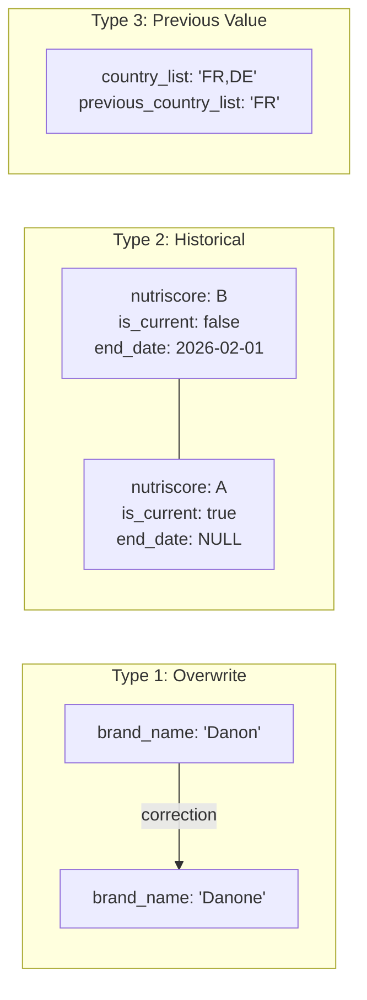
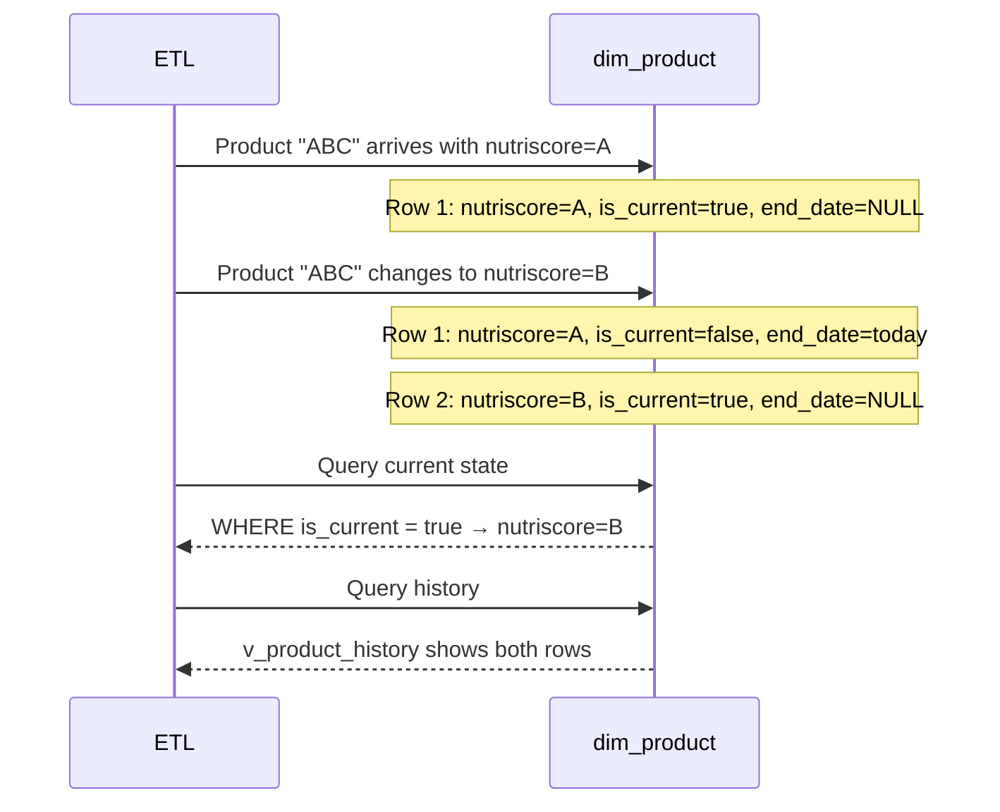
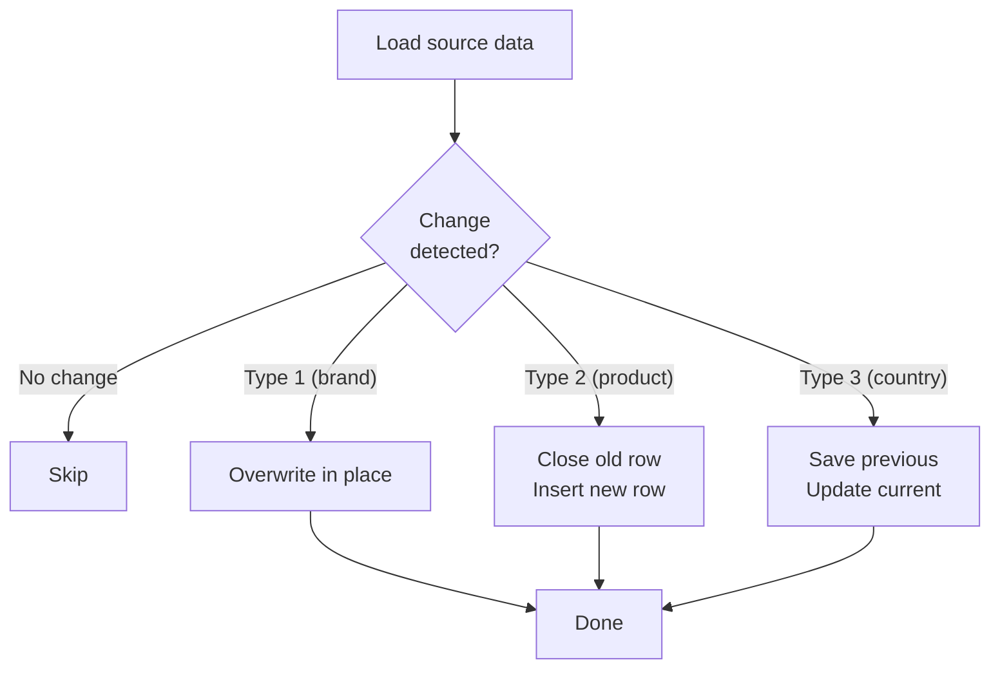

# Slowly Changing Dimensions

## SCD Implementation (C17)

NutriTrack implements all three Kimball SCD types to track how dimension data evolves over time.

## SCD Type Comparison



## SCD Type 1 — Overwrite (dim_brand)

Used for **corrections** where history is not needed.

```sql
-- scd_type1_update_brand()
UPDATE dw.dim_brand
SET brand_name = NEW.brand_name,
    parent_company = NEW.parent_company,
    last_updated = NOW()
WHERE brand_id = NEW.brand_id
  AND (brand_name IS DISTINCT FROM NEW.brand_name
    OR parent_company IS DISTINCT FROM NEW.parent_company);
```

**When to use**: Typo corrections, data quality fixes where the old value was simply wrong.

## SCD Type 2 — Historical Tracking (dim_product)

Used for **tracking changes over time** with full history preservation.



**Key columns**:

| Column | Purpose |
|--------|---------|
| `effective_date` | When this version became active |
| `end_date` | When this version was superseded (NULL = current) |
| `is_current` | Boolean flag for easy filtering |

**Change detection**: Uses `IS DISTINCT FROM` to compare all tracked columns.

## SCD Type 3 — Previous Value (dim_country)

Used when only the **immediately previous value** needs to be retained.

```sql
-- scd_type3_update_country()
UPDATE dw.dim_country
SET previous_country_list = country_list,  -- save old value
    country_list = NEW.country_list,       -- apply new value
    last_updated = NOW()
WHERE country_id = NEW.country_id
  AND country_list IS DISTINCT FROM NEW.country_list;
```

**Trade-off**: Only stores one level of history (current + previous), but uses no additional rows.

## Integration into ETL

All SCD operations are integrated into the `etl_load_warehouse` DAG:



## History Query Views

```sql
-- v_product_history: See all versions of a product
SELECT barcode, product_name, nutriscore_grade,
       effective_date, end_date, is_current
FROM dw.v_product_history
WHERE barcode = '3017620422003'
ORDER BY effective_date;
```
