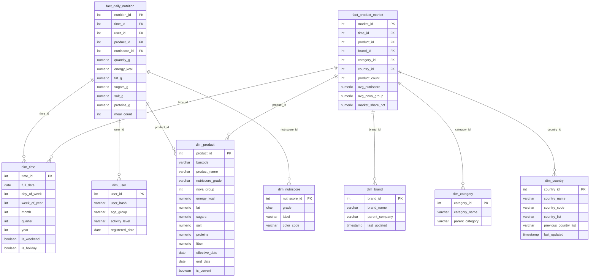

# Star Schema

## Data Warehouse Design (C13)

The data warehouse uses a **star schema** with 7 dimension tables and 2 fact tables, implemented in the `dw` schema of PostgreSQL.

## Entity Relationship Diagram

## Design Decisions

### Bottom-Up Approach (Kimball)

The warehouse follows a **bottom-up** (Kimball) methodology:

1. **Business requirements first** — analytics needs drove the schema
2. **Dimensional modeling** — star schema for query performance
3. **Incremental delivery** — datamarts built as analytical views
4. **Conformed dimensions** — shared across fact tables

### Dimension Details

| Dimension | Rows | SCD Type | Key Business Use |
|-----------|------|----------|-----------------|
| `dim_time` | ~7,300 | N/A (pre-populated 20 years) | Date-based analysis |
| `dim_product` | ~50,000 | **Type 2** (historical) | Product evolution tracking |
| `dim_brand` | ~5,000 | **Type 1** (overwrite) | Brand corrections |
| `dim_category` | ~500 | Static | Product classification |
| `dim_country` | ~200 | **Type 3** (previous value) | Country changes |
| `dim_user` | Anonymized | Static | User nutrition patterns |
| `dim_nutriscore` | 5 | Static | A–E grade lookup |

### Fact Tables

| Fact | Grain | Measures | Refresh |
|------|-------|----------|---------|
| `fact_daily_nutrition` | 1 row per user per product per day | energy, fat, sugars, salt, proteins, meal_count | Daily |
| `fact_product_market` | 1 row per product per brand per category per country per day | product_count, avg_nutriscore, avg_nova, market_share | Daily |
