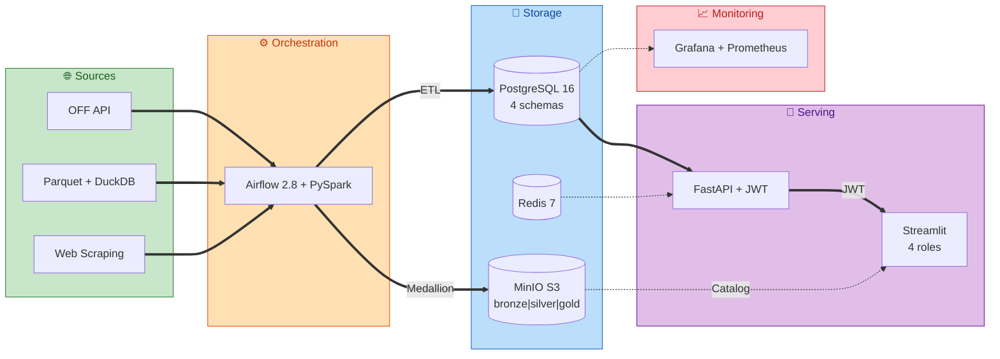
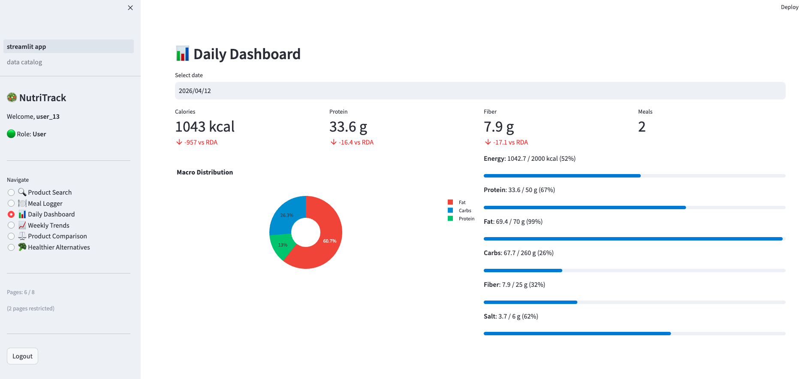

<div class="md-hero" markdown>
<div class="md-hero-content" markdown>

# NutriTrack

Nutritional Data Engineering Platform — from raw data to analytical dashboards

<div class="hero-stats">
<div class="hero-stat"><strong>798K</strong> Products</div>
<div class="hero-stat"><strong>15</strong> Services</div>
<div class="hero-stat"><strong>7</strong> DAGs</div>
<div class="hero-stat"><strong>4</strong> Roles</div>
<div class="hero-stat"><strong>&lt;100 EUR/yr</strong> OPEX</div>
</div>

</div>
</div>

Built by [**Reetika Gautam**](https://www.linkedin.com/in/reetika-gautam/) as a capstone project for the **RNCP37638 Data Engineer certification** (Level 7), covering all 21 competencies across 4 evaluation blocks.

[Portfolio](http://zafire.in/?i=1){ .md-button } [LinkedIn](https://www.linkedin.com/in/reetika-gautam/){ .md-button } [GitHub](https://github.com/Reetika12795/NutriTrack){ .md-button .md-button--primary }

---

## Architecture at a Glance





---

## Certification Blocks

NutriTrack addresses all 4 blocks of the RNCP37638 certification:

| Block | Title | Competencies | Documentation |
|-------|-------|-------------|---------------|
| **1** | Steer a Data Project | C1 -- C7 | [Need Analysis](block1/need-analysis.md) / [Architecture](block1/architecture.md) / [Planning](block1/planning.md) |
| **2** | Data Collection & Sharing | C8 -- C12 | [Extraction](block2/extraction.md) / [Cleaning](block2/cleaning.md) / [Database & API](block2/database-api.md) |
| **3** | Data Warehouse | C13 -- C17 | [Star Schema](block3/star-schema.md) / [ETL Pipelines](block3/etl-pipelines.md) / [Maintenance & SCD](block3/maintenance.md) |
| **4** | Data Lake | C18 -- C21 | [Medallion](block4/medallion.md) / [Catalog & Governance](block4/governance.md) |

---

## Quick Start

```bash
git clone https://github.com/Reetika12795/NutriTrack.git
cd NutriTrack/nutritrack
docker compose up -d --build
```

Wait 2--3 minutes for initialization, then access:

| Service | URL | Credentials |
|---------|-----|-------------|
| Airflow | [localhost:8080](http://localhost:8080) | `admin` / `admin` |
| FastAPI Docs | [localhost:8000/docs](http://localhost:8000/docs) | JWT token |
| Streamlit | [localhost:8501](http://localhost:8501) | demo accounts |
| MinIO Console | [localhost:9001](http://localhost:9001) | `minioadmin` / `minioadmin123` |
| Grafana | [localhost:3000](http://localhost:3000) | `admin` / `admin` |
| MailHog | [localhost:8025](http://localhost:8025) | none |

See the full [Quick Start guide](quickstart.md) for prerequisites and troubleshooting.

---

## Tech Highlights

- **PySpark 3.5** cleaning pipeline with 7 rules, processing 798K products
- **Star schema** data warehouse with SCD Type 1, 2, and 3
- **Medallion architecture** data lake (Bronze / Silver / Gold) on MinIO
- **4-role RBAC** across PostgreSQL, FastAPI, MinIO, and Streamlit
- **RGPD-compliant** with personal data registry and automated cleanup
- **~48K EUR engineering CAPEX** (one-time), **< 100 EUR/year OPEX** (fully open-source)

---

<div style="display: flex; align-items: center; justify-content: flex-end; gap: 1.5em; margin-top: 2em; padding: 1.5em; background: rgba(103, 58, 183, 0.08); border-radius: 12px; border: 1px solid rgba(103, 58, 183, 0.2);">

<div style="text-align: right;">
<p style="font-size: 1.1em; font-weight: 600; margin: 0; color: #4a148c;">Developed and managed by</p>
<p style="font-size: 1.4em; font-weight: 700; margin: 0.2em 0;">Reetika Gautam & Team</p>
<p style="font-size: 0.9em; margin: 0.3em 0; opacity: 0.8;">Data Engineer | Publicis Resources</p>
<p style="margin: 0.5em 0 0 0;">
<a href="http://zafire.in/?i=1">Portfolio</a> · 
<a href="https://www.linkedin.com/in/reetika-gautam/">LinkedIn</a> · 
<a href="https://github.com/Reetika12795/NutriTrack">GitHub</a>
</p>
</div>


</div>
