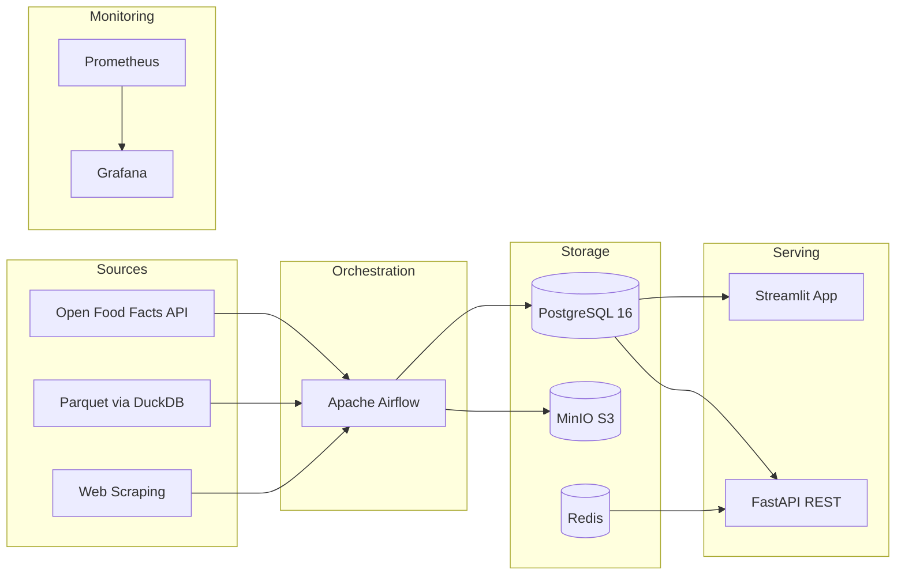

# NutriTrack

**Nutritional Data Engineering Platform**

A production-ready data engineering platform that collects, cleans, warehouses, and serves nutritional data from Open Food Facts — demonstrating end-to-end pipeline architecture from raw extraction to analytical dashboards.

Built as a capstone project for the **RNCP37638 Data Engineer certification** (Level 7 / Master's equivalent), covering all 21 competencies across 4 evaluation blocks.

---

## Key Metrics

| Metric | Value |
|--------|-------|
| Raw products collected | **798,177** (French products from Open Food Facts) |
| Cleaned products | **777,116** (2.6% removal rate) |
| Docker services | **15** |
| Airflow DAGs | **7** (daily, weekly, monthly schedules) |
| API endpoints | **8** (JWT + RBAC) |
| Streamlit pages | **28** across 4 roles |
| Star schema tables | **7 dimensions + 2 facts + 6 datamarts** |
| Grafana dashboards | **6** |

---

## Architecture at a Glance




---

## Certification Blocks

NutriTrack addresses all 4 blocks of the RNCP37638 certification:

| Block | Title | Competencies | Documentation |
|-------|-------|-------------|---------------|
| **1** | Steer a Data Project | C1 -- C7 | [Need Analysis](block1/need-analysis.md) / [Architecture](block1/architecture.md) / [Planning](block1/planning.md) |
| **2** | Data Collection & Sharing | C8 -- C12 | [Extraction](block2/extraction.md) / [Cleaning](block2/cleaning.md) / [Database & API](block2/database-api.md) |
| **3** | Data Warehouse | C13 -- C17 | [Star Schema](block3/star-schema.md) / [ETL Pipelines](block3/etl-pipelines.md) / [Maintenance & SCD](block3/maintenance.md) |
| **4** | Data Lake | C18 -- C21 | [Medallion](block4/medallion.md) / [Catalog & Governance](block4/governance.md) |

---

## Quick Start

```bash
git clone https://github.com/Reetika12795/NutriTrack.git
cd NutriTrack/nutritrack
docker compose up -d --build
```

Wait 2--3 minutes for initialization, then access:

| Service | URL | Credentials |
|---------|-----|-------------|
| Airflow | [localhost:8080](http://localhost:8080) | `admin` / `admin` |
| FastAPI Docs | [localhost:8000/docs](http://localhost:8000/docs) | JWT token |
| Streamlit | [localhost:8501](http://localhost:8501) | demo accounts |
| MinIO Console | [localhost:9001](http://localhost:9001) | `minioadmin` / `minioadmin123` |
| Grafana | [localhost:3000](http://localhost:3000) | `admin` / `admin` |
| MailHog | [localhost:8025](http://localhost:8025) | none |

See the full [Quick Start guide](quickstart.md) for prerequisites and troubleshooting.

---

## Tech Highlights

- **PySpark 3.5** cleaning pipeline with 7 rules, processing 798K products
- **Star schema** data warehouse with SCD Type 1, 2, and 3
- **Medallion architecture** data lake (Bronze / Silver / Gold) on MinIO
- **4-role RBAC** across PostgreSQL, FastAPI, MinIO, and Streamlit
- **RGPD-compliant** with personal data registry and automated cleanup
- **Zero CAPEX** -- fully containerized, under 100 EUR/year OPEX
