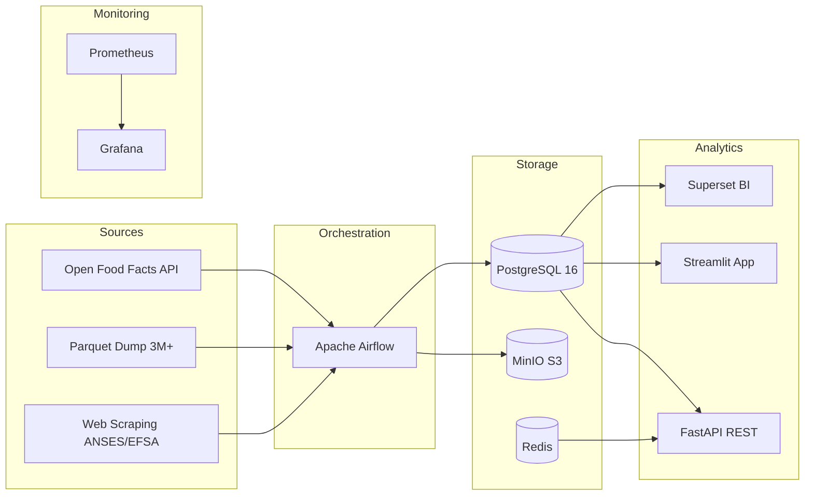

# NutriTrack

**Nutritional Data Engineering Platform**

A comprehensive, production-ready data engineering platform demonstrating end-to-end data pipeline architecture — from raw data extraction to analytical dashboards.

Built as a capstone project for the **RNCP37638 Data Engineer certification** (Level 7 / Master's equivalent), covering all 21 competencies across 4 blocks.

---

## Architecture at a Glance



## Tech Stack

| Layer | Technology | Purpose |
|-------|-----------|---------|
| **Database** | PostgreSQL 16 | OLTP + Data Warehouse (star schema) |
| **Data Lake** | MinIO (S3-compatible) | Bronze / Silver / Gold layers |
| **Orchestration** | Apache Airflow 2.8.1 | 7 DAGs for ETL pipelines |
| **API** | FastAPI | REST API with JWT auth & RBAC |
| **Frontend** | Streamlit | User-facing nutrition tracker |
| **Analytics** | Apache Superset 6.0.1 | BI dashboards & data exploration |
| **Cache** | Redis 7 | API response caching |
| **Monitoring** | Prometheus + Grafana | 6 dashboards + SLA tracking |
| **CI/CD** | GitHub Actions | Lint, test, Docker build validation |
| **Container** | Docker Compose | 15+ services, single-command deploy |

## Quick Start

```bash
# Clone and start all services
git clone git@github.com-personal:Reetika12795/NutriTrack.git
cd NutriTrack/nutritrack
docker compose up -d --build

# Wait 2-3 minutes for initialization, then access:
# Airflow:    http://localhost:8080  (admin/admin)
# FastAPI:    http://localhost:8000/docs
# Streamlit:  http://localhost:8501
# Superset:   http://localhost:8088  (admin/admin)
# MinIO:      http://localhost:9001  (minioadmin/minioadmin123)
# Grafana:    http://localhost:3000  (admin/admin)
# MailHog:    http://localhost:8025
```

## Project Highlights

- **15 Docker services** orchestrated via Docker Compose
- **7 Airflow DAGs** for automated ETL (daily/weekly/monthly schedules)
- **Star schema** data warehouse with SCD Type 1, 2, and 3
- **Medallion architecture** data lake (Bronze → Silver → Gold)
- **56 automated tests** with 3 CI/CD pipelines
- **RGPD-compliant** with personal data registry and automated cleanup
- **Role-based access control** across PostgreSQL, API, MinIO, and Superset
