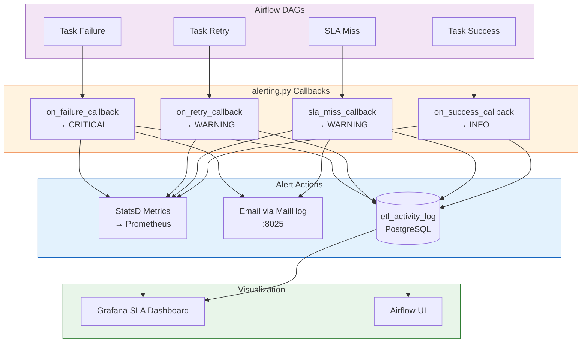
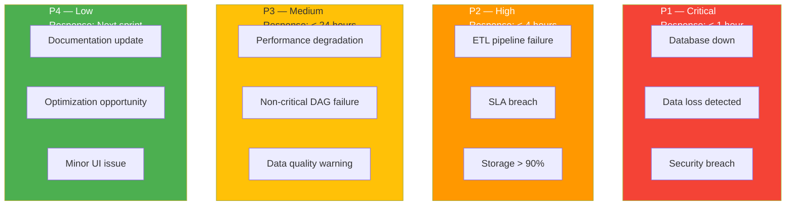

# Alerting System

## Overview (C16)

Multi-layered alerting system that logs events to a database, sends email notifications, and displays metrics on Grafana dashboards.

## Alert Architecture



## Alert Categories

| Category | Severity | Trigger | Response |
|----------|----------|---------|----------|
| **CRITICAL** | P1 | Task failure | Immediate investigation, email alert |
| **WARNING** | P2 | Task retry, SLA miss | Investigate within 4 hours |
| **INFO** | P4 | Task success, routine operations | No action needed |

## Activity Log Schema

```sql
CREATE TABLE app.etl_activity_log (
    log_id          SERIAL PRIMARY KEY,
    dag_id          VARCHAR(100),
    task_id         VARCHAR(100),
    execution_date  TIMESTAMP,
    event_type      VARCHAR(50),    -- task_failure, task_success, sla_miss, ...
    alert_category  VARCHAR(20),    -- CRITICAL, WARNING, INFO
    message         TEXT,
    details         JSONB,          -- structured context (exception, duration, etc.)
    created_at      TIMESTAMP DEFAULT NOW()
);
```

## SMTP Configuration

MailHog provides a test SMTP server for capturing email alerts during development and demos:

```yaml
# docker-compose.yml
mailhog:
  image: mailhog/mailhog:latest
  ports:
    - "1025:1025"   # SMTP server
    - "8025:8025"   # Web UI to view emails

# Airflow SMTP settings
AIRFLOW__SMTP__SMTP_HOST: mailhog
AIRFLOW__SMTP__SMTP_PORT: "1025"
AIRFLOW__SMTP__SMTP_MAIL_FROM: "airflow@nutritrack.local"
```

**Web UI**: http://localhost:8025 — view all captured alert emails.

## Maintenance Priority Matrix (ITIL)



## Escalation Procedure

| Level | Who | When |
|-------|-----|------|
| **L1** | Data Engineer on-call | First response, investigate |
| **L2** | Senior Data Engineer | L1 unable to resolve in SLA |
| **L3** | Platform Architect | System-wide or architectural issue |
