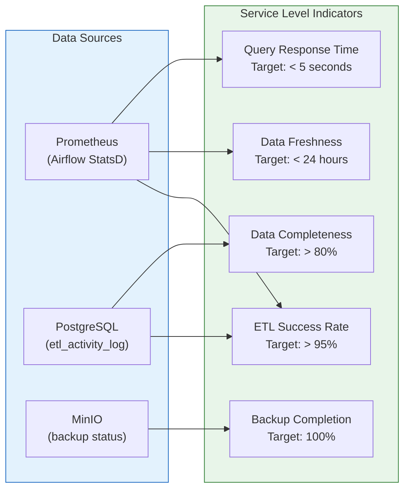
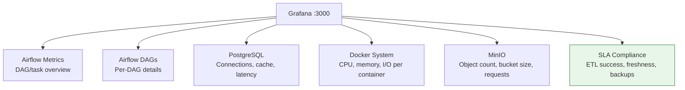

# SLA Dashboard

## Service Level Indicators

The Grafana SLA Compliance dashboard tracks 5 key service indicators against their targets.

## Dashboard Panels

The `sla-compliance.json` Grafana dashboard contains **10 panels**:

### Row 1 — SLA Gauges

| Panel | Metric | Target | Source |
|-------|--------|--------|--------|
| Overall SLA Compliance | Composite score | > 95% | Calculated |
| ETL Success Rate | `airflow_ti_successes / (successes + failures)` | > 95% | StatsD |
| Data Freshness | Time since last successful DAG run | < 24h | StatsD |
| Backup Completion | Backup task success rate | 100% | StatsD |

### Row 2 — Trends

| Panel | Type | Description |
|-------|------|-------------|
| ETL Success Rate (7d) | Time series | Daily success rate trend over 7 days |
| DAG Run Outcomes | Stacked bar | Success vs failure count per DAG |

### Row 3 — Performance

| Panel | Type | Description |
|-------|------|-------------|
| Avg Query Response Time | Stat | PostgreSQL query latency |
| DAG Run Duration | Time series | Per-pipeline execution time |
| PostgreSQL Storage | Stat | Database size usage |

### Row 4 — Summary

| Panel | Type | Description |
|-------|------|-------------|
| SLA Compliance Table | Table | All SLIs with current value, target, and status |

## Prometheus Metrics Used

| Metric | Type | Source |
|--------|------|--------|
| `airflow_ti_successes` | Counter | StatsD exporter |
| `airflow_ti_failures` | Counter | StatsD exporter |
| `airflow_dag_run_duration` | Histogram | StatsD exporter |
| `airflow_dagrun_duration_success` | Summary | StatsD exporter |
| `pg_stat_activity_count` | Gauge | postgres-exporter |
| `pg_database_size_bytes` | Gauge | postgres-exporter |

## All Grafana Dashboards

