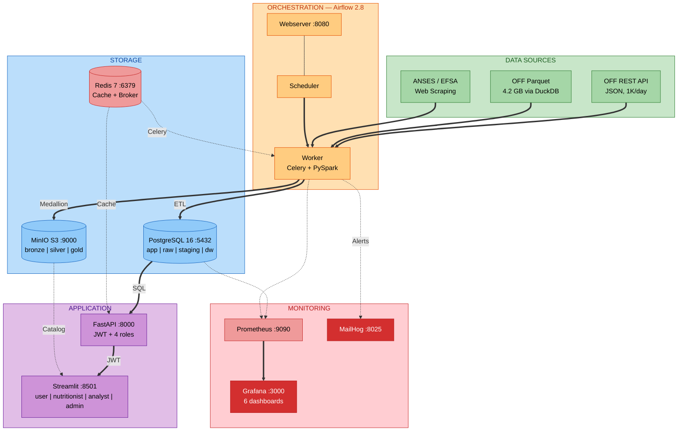

# System Architecture

## Overview

NutriTrack is a containerized data engineering platform with **15 Docker services** spanning 5 layers: data sources, orchestration, storage, analytics, and monitoring. All services deploy with a single `docker compose up -d` command.

## Full Architecture Diagram

## Service Matrix

| # | Service | Image | Port(s) | Layer | Purpose |
|---|---------|-------|---------|-------|---------|
| 1 | `postgres` | postgres:16-alpine | 5432 | Storage | OLTP (app) + Data Warehouse (dw) + Raw + Staging |
| 2 | `redis` | redis:7-alpine | 6379 | Storage | API response cache + Airflow Celery broker |
| 3 | `minio` | minio/minio:latest | 9000, 9001 | Storage | S3-compatible data lake (4 buckets) |
| 4 | `airflow-webserver` | custom | 8080 | Orchestration | Airflow UI and API |
| 5 | `airflow-scheduler` | custom | -- | Orchestration | DAG scheduling and task triggering |
| 6 | `airflow-worker` | custom | -- | Orchestration | Celery task execution (PySpark available) |
| 7 | `fastapi` | custom | 8000 | Analytics | REST API with JWT auth and RBAC (8 endpoints) |
| 8 | `streamlit` | custom | 8501 | Analytics | 4-role web frontend (28 pages total) |
| 9 | `mailhog` | mailhog/mailhog | 1025, 8025 | Analytics | SMTP test server for alert emails |
| 10 | `prometheus` | prom/prometheus | 9090 | Monitoring | Metrics collection and storage |
| 11 | `grafana` | grafana/grafana | 3000 | Monitoring | 6 dashboards for SLA and operations |
| 12 | `statsd-exporter` | prom/statsd-exporter | 9102, 9125 | Monitoring | Airflow metrics bridge to Prometheus |
| 13 | `cadvisor` | gcr.io/cadvisor | 8081 | Monitoring | Container resource metrics |
| 14 | `node-exporter` | prom/node-exporter | 9100 | Monitoring | Host OS metrics |
| 15 | `postgres-exporter` | prometheuscommunity/postgres-exporter | 9187 | Monitoring | PostgreSQL metrics |

## PostgreSQL Schema Layout

NutriTrack uses a single PostgreSQL instance with 4 schemas for logical separation:

| Schema | Purpose | Tables |
|--------|---------|--------|
| `app` | Operational OLTP data | users, products, meals, meal_items, etl_activity_log, rgpd_data_registry |
| `raw` | Raw extracted data before cleaning | raw_products_api, raw_products_parquet, raw_guidelines |
| `staging` | Intermediate processing | staging_products, data_quality_checks |
| `dw` | Star schema data warehouse | 7 dimensions + 2 facts + 6 datamart views |

## Persistent Volumes

| Volume | Service | Purpose |
|--------|---------|---------|
| `postgres_data` | PostgreSQL | Database files |
| `redis_data` | Redis | Cache persistence |
| `minio_data` | MinIO | Object store data |
| `prometheus_data` | Prometheus | Metric time series |
| `grafana_data` | Grafana | Dashboard state |

## Network

All services communicate over a shared Docker bridge network (`nutritrack_default`). External access is through mapped ports only. Internal service names resolve via Docker DNS.
