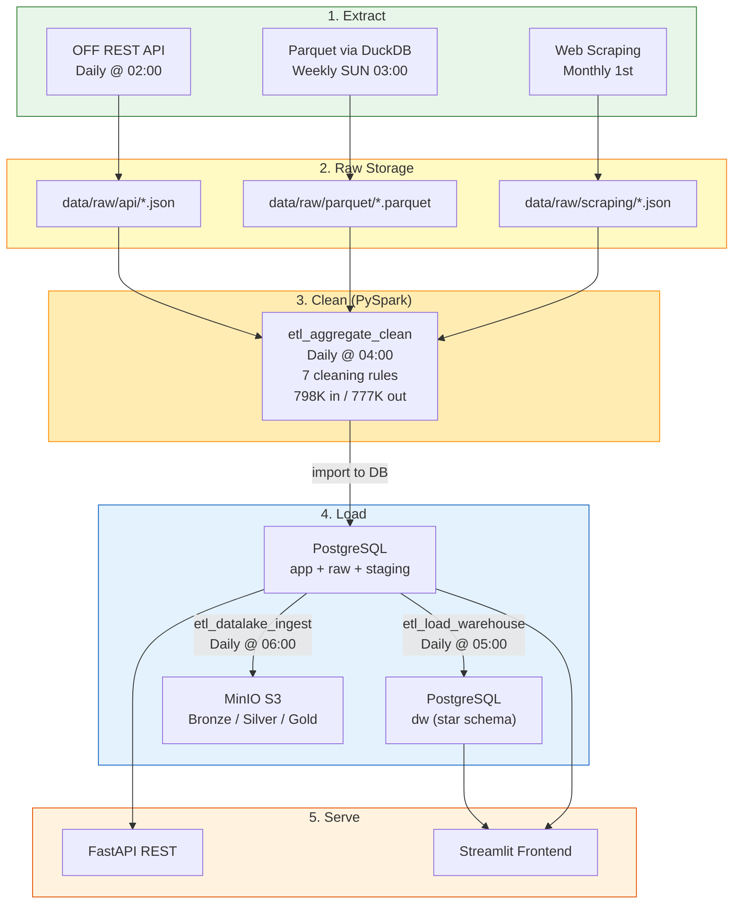

# Data Flow

## End-to-End Pipeline

Data flows through 5 stages: Extract, Clean, Load (DB), Transform (DW), and Ingest (Lake).

## Daily Schedule

All times in UTC. Orchestrated by Apache Airflow.

```mermaid
gantt
    title Daily ETL Schedule (UTC)
    dateFormat HH:mm
    axisFormat %H:%M

    section Extraction
    OFF API Extract       :api, 02:00, 60min
    Parquet Extract (SUN) :pq, 03:00, 90min
    Scraping (1st of month):sc, 03:00, 60min

    section Transform
    Aggregate & Clean     :clean, 04:00, 45min

    section Load
    Load Warehouse        :dw, 05:00, 30min
    Datalake Ingest       :dl, 06:00, 45min

    section Maintenance
    Backup & Maintenance  :bk, 02:00, 30min
```

## Flux Matrix

| Source | Format | Target | Script | Frequency | Volume |
|--------|--------|--------|--------|-----------|--------|
| OFF REST API | JSON | `data/raw/api/` | `extract_off_api.py` | Daily | ~1,000 products |
| OFF Parquet dump | Parquet | `data/raw/parquet/` | `extract_off_parquet.py` | Weekly (Sun) | 50,000+ products |
| ANSES/EFSA websites | HTML to JSON | `data/raw/scraping/` | `extract_scraping.py` | Monthly (1st) | Guidelines |
| Raw sources merged | Mixed | `data/cleaned/` | `aggregate_clean.py` | Daily | 798K in / 777K out |
| PostgreSQL (app) | SQL | DW star schema | `etl_load_warehouse.py` | Daily | Incremental |
| PostgreSQL (app) | Parquet/CSV | MinIO buckets | `etl_datalake_ingest.py` | Daily | Full snapshot |

## Data Volume Summary

| Stage | Records | Format | Storage |
|-------|---------|--------|---------|
| Raw (all sources combined) | 798,177 | JSON + Parquet | ~2 GB |
| Cleaned | 777,116 | Parquet + CSV | ~800 MB |
| Data Warehouse | 777K products + dimensions | PostgreSQL | ~500 MB |
| Data Lake (Bronze) | Raw copies | Original formats | ~2 GB |
| Data Lake (Silver) | Cleaned | Parquet | ~600 MB |
| Data Lake (Gold) | Aggregated | Parquet | ~100 MB |

!!! info "Extraction Sources"
    NutriTrack demonstrates 3 distinct extraction methods required by the certification: REST API, data file (Parquet via DuckDB), and web scraping (BeautifulSoup).
